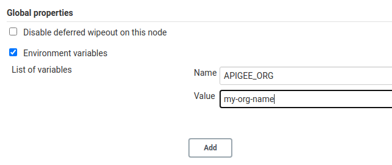
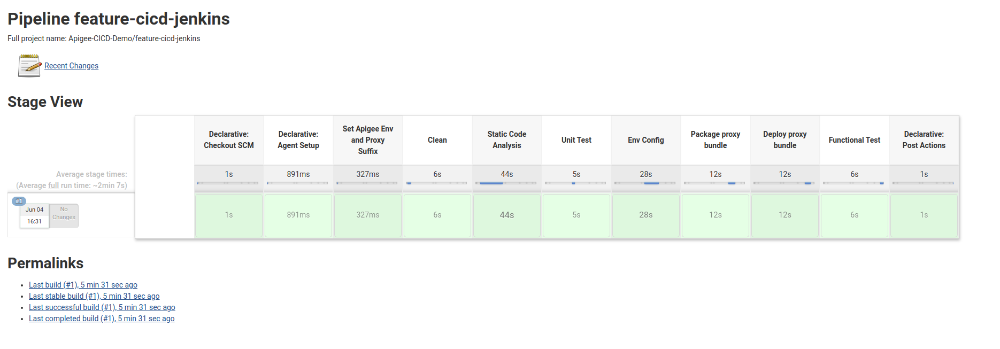

# Demo: Apigee CICD using Jenkins and Maven

## Goal

Demonstrate a CICD pipeline for Apigee using [Jenkins](https://www.jenkins.io/) and the [Apigee Deploy Maven Plugin](https://github.com/apigee/apigee-deploy-maven-plugin).

The CICD pipeline includes:
*   Git branch dependent Apigee environment selection and proxy naming to allow deployment of feature branches as separate proxies in the same environment
*   Static code analysis using [eslint](https://eslint.org/)
*   Unit testing using [mocha](https://mochajs.org/)
*   Integration testing of the deployed proxy using [apickli](https://github.com/apickli/apickli)
*   Packaging and deployment of the API proxy bundle using [Apigee Deploy Maven Plugin](https://github.com/apigee/apigee-deploy-maven-plugin)

## Target Audience

*   API Engineers
*   Operations
*   Security

## Limitations & Requirements

*   The Authentication to the Apigee management API is done using OAuth2. If you require MFA, please see the [documentation](https://github.com/apigee/apigee-deploy-maven-plugin#oauth-and-two-factor-authentication) for the Maven deploy plugin on how to configure MFA for the build.
*   The Jenkins setup in this demo uses Docker inside a Docker container. You will have to give permissions to your jenkins user to interact with the docker runtime.

## Demo Content

### Jenkins

The `jenkins` folder contains instructions on how to setup a dockerized Jenkins environment to run this demo. You can either use the the included instructions to configure a Jenkins server or use your existing server.

#### Option A: Configure Jenkins Docker Container

See the instructions in [./jenkins/README.md](./jenkins/README.md)

#### Option B: Use an existing Jenkins Setup

If you already have a current (version 2.200+) Jenkins instance you can also use that one for this demo.

You are responsible to ensure you have the following plugins enabled:
*   [Docker](https://plugins.jenkins.io/docker-plugin/)
*   [HTML Pubisher](https://plugins.jenkins.io/htmlpublisher/)
*   [Cucumber Reports](https://plugins.jenkins.io/cucumber-reports/)

### API Proxy

The folder `cicd-demo-v1` includes a simple API proxy bundle as well as the unit and integration testing for it.

For the purpose of this demo, the folder also includes the following resources:
*   [Jenkinsfile](./cici-demo-v1/Jenkinsfile) to define a Jenkins multi-branch pipeline.
*   [Dockerfile](./cicd-demo-v1/Dockerfile) to build a Jenkins agent runtime with all the required tooling.

## Demo Instructions

### Jenkins Configuration

Once Jenkins is configured as described above you need to configure the following:

#### Setup Apigee Credentials

This assumes you have the environment variables `APIGEE_USER` and `APIGEE_PASS` populated with your Apigee credentials. For the `JENKINS_KEY` please see [./jenkins/README.md](./jenkins/README.md).

```sh
curl -X POST \
    -u admin:$JENKINS_KEY \
    -H 'content-type:application/xml' \
    -d "
<com.cloudbees.plugins.credentials.impl.UsernamePasswordCredentialsImpl>
  <scope>GLOBAL</scope>
  <id>apigee</id>
  <description>Apigee CICD Credentials</description>
  <username>$APIGEE_USER</username>
  <password>$APIGEE_PASS</password>
</com.cloudbees.plugins.credentials.impl.UsernamePasswordCredentialsImpl>
" "http://localhost:8080/credentials/store/system/domain/_/createCredentials"
```
#### Set Apigee Org

The `APIGEE_ORG` environment variable can be specified in the global Jenkins properties at http://localhost:8080/configure or (if you forked this repo) in the Jenkinsfile.

**Note:** Setting the org as a global variable assumes that the *test* as well as *prod* environments are deployed under the same organization. If you want to deploy each environment to its own
environment, consider setting the branch specific environment variable in the Jenkinsfile.



## Create a Multi-Branch Jenkins Job

Use the UI to configure the Jenkins Job for multibranch pipelines:

1.  Path to the Jenkinsfile e.g. demos/cicd-jenkins/cicd-demo-v1/Jenkinsfile
1.  Set the Git repo accordingly e.g. [Apigee Devrel](https://github.com/apigee/devrel)
1.  (Optional) Set the build trigger / polling frequency

The `config.xml` contains a readily configured pipeline which may or may not be applicable given the detached versioning of the jenkins plugins:

```sh
curl -X POST -u admin:$JENKINS_KEY --header "Content-Type: application/xml" -d '@./jenkins/config.xml' http://localhost:8080/createItem?name=Apigee-CICD-Demo
```

## Run the pipeline

1.  Open the multi-branch pipeline you just created.
1.  Click `Scan Multibranch Pipeline Now` to detect branches with a Jenkinsfile.
1.  Explore the build(s) that get triggered.
1.  Explore the final build success.



## Promote to different stages and environments (feature/test/prod)

1.  Fork this repository and point your multi-branch jenkins pipeline to it.
1.  Create a new feature branch e.g. `feature/my-feature`
1.  Explore the newly created api-proxy in the test environment that corresponds to the feature branch
1.  Merge the feature branch into `master` and explore the promotion into test environment
1.  Merge the `master` branch into the branch `prod` and explore the promotion into prod environment
