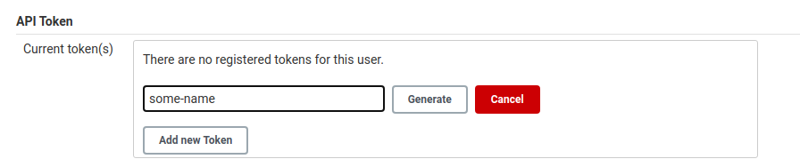

# Jenkins Setup

## Jenkins Build

To allow for the Jenkins container to use Docker-container based builds, we need build a new Docker image first:

```js
docker build -t apigee/jenkins .
```

## Run Jenkins with a mounted home folder

Although the volume mount for the jenkins_home directory is optional, it is highly encouraged.
A mounted jenkins_home avoids having to do the manual Jenkins configuration even if the container is stopped or restarted.

```sh
CICD_JENKINS_HOME=/var/tmp/cicd_jenkins_home

mkdir $CICD_JENKINS_HOME
sudo chown -R 1000:1000 $CICD_JENKINS_HOME

docker run -d -it -p 8080:8080 -p 50000:50000 --name jenkins \
    --group-add $(stat -c '%g' /var/run/docker.sock) \
    -v $CICD_JENKINS_HOME:/var/jenkins_home \
    -v /var/run/docker.sock:/var/run/docker.sock \
    --restart unless-stopped \
    apigee/jenkins:latest
```

## Manual Jenkins Init

To obtain an API key for configuring Jenkins via the provided API, follow these steps:

1.  Open a browser window at http://localhost:8080
1.  Once the Jenkins UI has loaded and prompts you for the admin key, supply the inital admin key which you can obtain from running `docker exec jenkins cat /var/jenkins_home/secrets/initialAdminPassword`
1.  Click the button `install suggested plugins` to install the default plugins
1.  In the case of errors, click `retry` and restart Jenkins (http://localhost:8080/restart) after you created your admin user.
1.  Create an admin user with the username `admin` (Password and Email can be anything)
1.  Navigate to `http://localhost:8080/me/configure`and generate an API token (token name is irrelevant), and store it in an `JENKINS_KEY` variable: `export JENKINS_KEY=<key goes here>`




## Install the required plugins

```sh
curl -u admin:$JENKINS_KEY -X POST -d '<jenkins><install plugin="htmlpublisher@1.22" /></jenkins>' --header 'Content-Type: text/xml' "http://localhost:8080/pluginManager/installNecessaryPlugins"

curl -u admin:$JENKINS_KEY -X POST -d '<jenkins><install plugin="cucumber-reports@5.0.2" /></jenkins>' --header 'Content-Type: text/xml' "http://localhost:8080/pluginManager/installNecessaryPlugins"

curl -u admin:$JENKINS_KEY -X POST -d '<jenkins><install plugin="docker-workflow@1.23" /></jenkins>' --header 'Content-Type: text/xml' "http://localhost:8080/pluginManager/installNecessaryPlugins"
```
