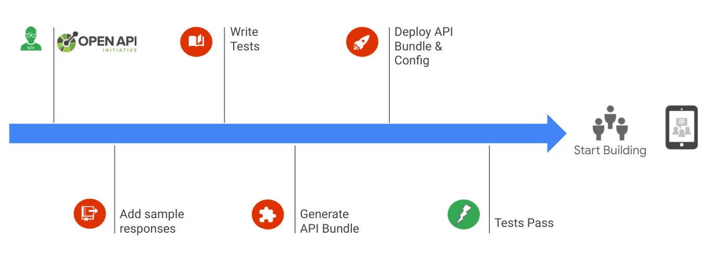

id: bdd-proxy-development

# Behaviour-Driven Proxy Development with Apigee

A 200 level lab demonstrating behavior-driven API development by building,
deploying and testing a mock API, generated from an Open API Specification.

## Overview

Duration: 0:02:00

This lab walks through the process of generating, deploying and testing a mock
proxy on Apigee.
The lab focuses on leveraging useful tools and best practices, with some
practical examples. Over the course of the lab you will step through
the process shown below. An Open API specification and test suite have already
been provided for the lab. You can use these as a reference
to leverage this same process in your own API development work.



We assume basic knowledge of the Apigee platform and you will get the most
from this lab if you already possess this knowledge.

Ideally you will have completed the Apigee courses on
[Design](https://www.coursera.org/learn/api-design-apigee-gcp),
[Development](https://www.coursera.org/learn/api-development-apigee-gcp) and
[Security](https://www.coursera.org/learn/api-security-apigee-gcp) Courses.
These are available through Coursera, Pluralsight or Qwiklabs.

Alternatively, completing the Apigee
[API Jam](https://github.com/apigee/apijam) will cover the same topics in
less depth.

Lets get started!

## Prerequisites

Duration: 0:30:00

An Apigee organisation (X or Hybrid) configured for external exposure is
required to complete this lab. See
[here](https://github.com/apigee/devrel/tree/main/tools/apigee-x-trial-provision)
for details on provisioning an Apigee X evaluation organisation.

### Tools

You will need to have the following dependencies configured in you local
environment in order to complete the lab tasks:

- Bash (Unix shell)
- [NodeJS](https://nodejs.org/en/) LTS version or above.
- [gcloud](https://cloud.google.com/sdk/docs/install)
- [git](https://git-scm.com/)
- [apigee-sackmesser](https://github.com/apigee/devrel/tree/main/tools/apigee-sackmesser)
- [apigeecli](https://github.com/srinandan/apigeecli)
- [jq](https://stedolan.github.io/jq/)

### Environment Variables

Commands used during the lab will require the following environment variables
to be configured.

``` bash
export TOKEN=$(gcloud auth application-default print-access-token)
export APIGEE_ENV=<apigee-environment-name>
export APIGEE_ORG=<gcp-project-name>
```

### oas-apigee-mock

Clone the Apigee DevRel repo and install the dependencies for the
oas-apigee-mock tool.

``` bash
git clone https://github.com/apigee/devrel.git
cd devrel/tools/oas-apigee-mock/
export LAB_HOME=$PWD
npm install
```

## Generate the proxy bundle and prepare tests

Duration: 0:10:00

### Generate an Apigee proxy from an Open API Specification

Use the `orders-apikey-header.yaml` Open API specification included
in the `$LAB_HOME/test/oas` folder to generate a proxy bundle.

``` bash
node $LAB_HOME/bin/oas-apigee-mock generateApi web-orders-proxy-v1 \
  -s $LAB_HOME/test/oas/orders-apikey-header.yaml \
  -o
```

### Update the apickli configuration to use your Environment Group's Hostname

Update the `before(function ()` block in
`$LAB_HOME/test/features/step_definitions/init.js` with a hostname from the
environment group you will deploying to. For example:

``` javascript
before(function () {
  this.apickli = new apickli.Apickli(
    "https",process.env.RUNTIME_HOST_ALIAS
  );
```

If you followed the
[Apigee X Trial Provisioning](https://github.com/apigee/devrel/tree/main/tools/apigee-x-trial-provision)
script, a hostname will have been stored in the `RUNTIME_HOST_ALIAS`
environment variable associated with the `eval-group` environment group.

You can also retrieve environment group information from you Apigee organisation
using `apigeecli`.

``` bash
apigeecli envgroups list -t "$TOKEN" -o "$APIGEE_ORG"
```

Using `jq` we can retrieve a hostname of an environment group and store it in the
`RUNTIME_HOST_ALIAS` variable.

``` bash
apigeecli envgroups list -t "$TOKEN" -o "$APIGEE_ORG" > environment-groups.json
RUNTIME_HOST_ALIAS=$(jq '.environmentGroups[0].hostnames[0]' -r < environment-groups.json )
export RUNTIME_HOST_ALIAS
echo "RUNTIME_HOST_ALIAS is $RUNTIME_HOST_ALIAS"
```

### Update the test suite proxy reference

Update the test suite `$LAB_HOME/test/features/orders-apikey-header.feature`
with the basepath for your proxy.`web-orders-proxy-v1` was used in the generate
proxy step earlier in this lab.

## Deploy and Test the Proxy

Duration: 0:10:00

### Test the Proxy

Lets start by running the test suite.

``` bash
cd $LAB_HOME
./node_modules/.bin/cucumber-js test/features/orders-apikey-header.feature --format json:test/test_report.json --publish-quiet
```

The test should fail as we have yet to deploy the proxy we generated
previously.

### Deploy the generated proxy to your Apigee Organisation

``` bash
sackmesser deploy -d "$LAB_HOME/api_bundles/web-orders-proxy-v1" --googleapi -t "$TOKEN" -o "$APIGEE_ORG" -e "$APIGEE_ENV"
```

### Start debugging

Turn on [debug](https://cloud.google.com/apigee/docs/api-platform/debug/trace)
and run the test suite again.

``` bash
cd $LAB_HOME
./node_modules/.bin/cucumber-js test/features/orders-apikey-header.feature --format json:test/test_report.json --publish-quiet
```

Once again the tests should fail but for a different reason. Use the Apigee
debug tool to investigate the cause.

## Create an  API Product, Developer and App

Duration: 0:10:00

The generated proxy is protected by a Verify API Key policy (as specified
in the Open API Specification used), a valid API Key is needed in order to
successfully make API calls to the proxy. To obtain an API Key we need to
create an API product which includes our proxy and register a developer and
application which will use that API Product.

``` bash
apigeecli products create -t "$TOKEN" -o "$APIGEE_ORG" --name "web-orders" --proxies "web-orders-proxy-v1" --envs "$APIGEE_ENV" --approval "auto"
apigeecli devs create -t "$TOKEN" -o "$APIGEE_ORG" --email "web-orders@example.com" --user "web-orders@example.com" --first "Web" --last "Developer"
apigeecli apps create -t "$TOKEN" -o "$APIGEE_ORG" --email "web-orders@example.com" --prods "web-orders" --name "web-orders-app" > app.json

APIKEY=$(jq '.credentials[0].consumerKey' -r < app.json )
export APIKEY
echo "APIKEY is $APIKEY"
```

### Retest the Proxy

A valid API Key is now available as an environment variable and can now be
used by the test suite.
Turn on [debug](https://cloud.google.com/apigee/docs/api-platform/debug/trace)
again, run the test suite and verify the tests are now passing.

``` bash
cd $LAB_HOME
./node_modules/.bin/cucumber-js test/features/orders-apikey-header.feature --format json:test/test_report.json --publish-quiet
```

## Summary

You have generated, deployed and tested a mock API
proxy on Apigee using a behavior-driven development approach.


