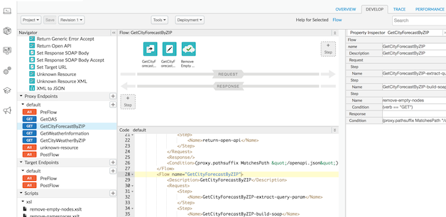
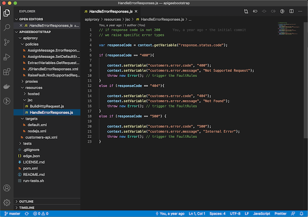
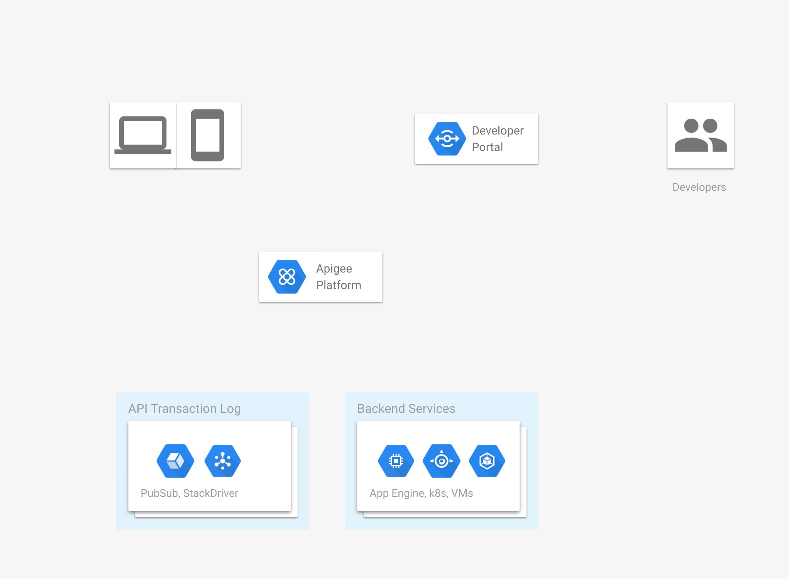
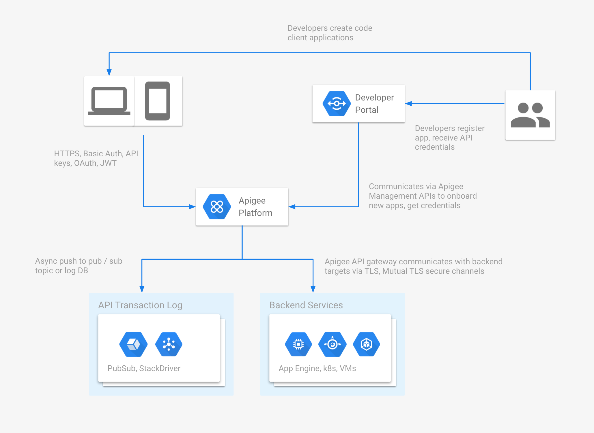

id: best-practices-hackathon

# Apigee Best Practices Hackathon

## Introduction

Welcome to the **Apigee Best Practices Hackathon**!

The main goal of this hackathon is to arm you with Apigee development best
practices and to help you build better solutions for your clients.

It is hands on session which focuses on the Apigee best practices and practical
examples for day to day projects.

We assume the basic knowledge of Apigee platform and you will get the most from
this hackathon if you do.

Ideally you will have completed the Coursera Apigee
[Design](https://www.coursera.org/learn/api-design-apigee-gcp),
[Development](https://www.coursera.org/learn/api-development-apigee-gcp) and
[Security](https://www.coursera.org/learn/api-security-apigee-gcp) Courses.

Alternatively, completing the Apigee [API Jam](https://github.com/apigee/apijam)
will cover the same topics in less depth.

Lets get started!

## Prerequisites

### Structure

During this hackathon we will follow the practical business use case for
building a publicly-facing API endpoint on Google's Apigee platform.

- We have several timeboxed, practical API design and development tasks for
  attendees to complete
- Instructor will follow up with with example implementation
- We discuss the best practices for task specifics before moving to the next
  topic

### Tools

Here are the prerequisites for completing the tasks:

- Web Browser (recent version of [Chrome](https://www.google.com/chrome/) or
  [Firefox](https://www.mozilla.org/en-GB/firefox/new/))
- Access to Apigee Account. It can be free Apigee
  [Evaluation Account](https://login.apigee.com/sign__up)
- [Git](https://git-scm.com/book/en/v2/Getting-Started-Installing-Git),
  [Maven](https://maven.apache.org/) (3.0.2+),
  [Java JDK](https://java.com/en/download/manual.jsp) (8+) and
  [NodeJS](https://nodejs.org/) (10+)
- A REST Client - [Postman](https://www.postman.com/) or
  [Curl](https://curl.haxx.se/)
- Favourite text editor - Visual Studio [Code](https://code.visualstudio.com/),
  `vim`, etc.

### Best Practices

#### Web UI

Apigee has Web UI Development Environment. It is great for visual representation
of Apigee APIs, configuration and real time tracing, but it isn't the only way
to manage the platform.

#### Apigee Management APIs

The Best Practices of the API Development Lifecycle utilise the Apigee
Management APIs for API development and operations. This enables:

- Source Control Management
- Use Continuous Integration and TDD / BDD patterns
- Multiple developers / team environments

In this hackathon we will use the tools and lifecycle commonly met in production
grade Apigee projects.

## Scenario

We will developer APIs for a startup in today's hackathon.

### Global Fintech Startup

- _We Move Your Money Fast_ is a global fintech startup

- They providing their enterprise customers with a set of Public APIs

- They want to introduce a Currency Exchange API. This API must provide a real
  time currency exchange rates as well as facilitate the actual currency
  exchange transactions.

- Due to a rapidly growing number of customers, API security, performance and
  uptime are essential

#### Considerations

- How will they apply the best API security practices to new Currency Exchange
  API hosted on Google Apigee?
- How will they achieve the best Currency Exchange API performance?
- How will customers be onboarded to use the Currency Exchange API?

In addition, in order to fit _We Move Your Money Fast_ technology standards:

- What are the best architecture patterns while using the Apigee platform?
- How can they automate the API deployment lifecycle using existing Continuous
  Integration systems?

## Architecture

### Architecture Constraints

Apigee SaaS has the following constraints:

- Apigee SaaS is hosted on Google Cloud Platform. All client applications and
  backend targets must also be accessible on the public internet.
- VPNs and network peering are not supported between Apigee and backends
- At the transport layer, Mutual TLS is supported and recommend to secure target
  communications
- At the application layer, OAuth 2, JWTs or Basic Authentication can also be
  used

### Task

- Draw your own Architecture diagram indicating connections between architecture
  components. Focus on the data flows and communication security.
- For a good starting point, please use: <https://tinyurl.com/yak9vox2>
- We have 5 minutes to complete the task
  [timer](https://www.google.com/search?q=timer+5min).

## Architecture - Solution

### Flows

- Application developers use the Developer Portal to register and retrieve API
  credentials.
- Client applications accessing public API hosted on Apigee will use HTTPS and
  API keys, OAuth 2.0 access tokens, or signed JSON Web Tokens (JWT).
- Apigee communicates with target applications over TLS / Mutual TLS encrypted
  connection.
- Target applications use Access Control policies of Apigee Message Processor
  IPs.
- Apigee can also proxy Pub/Sub publish APIs for async processing

## Developer Environment Setup

### Apigee API Development Lifecycle

### Setup considerations

- An API Proxy or Environment Resources is just XML that is sent to the
  Management APIs. We can use our own favourite tools to help with this.
- Rather than creating API Proxies from scratch, templates can be used to
  encourage consistency across teams
- Environment Configuration can also be stored in source control rather than
  being managed in the UI
- There are many Open Source examples of tooling to help
  - Apigee [Linting](https://github.com/apigee/apigeelint)
  - Maven [Proxy](https://github.com/apigee/apigee-deploy-maven-plugin) and
    [Environment Configuration](https://github.com/apigee/apigee-config-maven-plugin)
    Deployment
  - NodeJS
    [Proxy and Environment Configuration](https://www.npmjs.com/package/apigeetool)
    Deployment
  - [Java](https://github.com/popularowl/apigeebootstrap) or
    [NodeJS](https://github.com/apigee/devrel/tree/main/references/proxy-template)
    based bootstrap projects

### Task

- Clone the Sample Project suggested by your instructor
- Follow the Quick Start instructions to bootstrap an API proxy named
  `currency-v1`
- Open the proxy in your favourite text editor and look around
- Deploy to your free organization

We have 10 minutes to complete the task -
[timer](https://www.google.com/search?q=timer+10min).

## Backend Mocking

### Problem

It is fast to create new APIs, but we have dependencies on backend systems.

Generally these are:

- Slower to develop
- Challenging to set up connectivity
- More difficult to manage test data

By creating and hosting mocks in Apigee, we can isolate the API management
functionality and remove this dependencies.

### Approach

It is possible to build mocks with the following methods:

- [Assign
  Message](https://docs.apigee.com/api-platform/reference/policies/assign-message-policy)
  policy - allows you to simply setup single mocked API responses or
  automatically [generate them from an Open API
  Specification](https://github.com/apigee/devrel/tree/main/tools/oas-apigee-mock)
- Javascript extension
  [Policy](https://community.apigee.com/articles/80296/simple-mocking-with-javascript-callout.html)
- Node.js mocks via Cloud Run
  - multiple open source projects can be used for building more advanced API
    mocks on Node.js: [Nock](https://github.com/nock/nock), [Swagger
    tools](https://www.npmjs.com/package/swagger-tools), [API OAS
    Mocker](https://github.com/apigee/devrel/tree/main/tools/oas-apigee-mock),
    [amockjs](https://github.com/sauliuz/amokjs) and others.
- Standalone mocking servers can also be used for more advanced API mocking
  setup hosted outside of Apigee, such as [WireMock](http://wiremock.org/)

### Task

- Create a Mock using one of the methods for the API Requests/Responses below or
  based off of this [OAS
  file](https://github.com/apigee/devrel/tree/main/labs/best-practices-hackathon/assets/currency-conversion-spec.yaml).

#### Currency rates Mock

    GET /mock/v1/currency/latest

    200 OK
    {
        "success": true,
        "base": "GBP",
        "date": "2020-07-01",
        "rates": {
            "AUD": 1.86,
            "CAD": 1.69,
            "CHF": 1.17,
            "CNY": 8.73,
            "EUR": 1.10,
            "JPY": 132.19,
            "USD": 1.23
        },
        "internal-traceid": "123e4567-e89b-12d3-a456-426614174000"
    }

#### Convert Currency Mock

    GET /mock/v1/currency/convert?from=GBP&to=EUR&amount=100

    200 OK
    {
        "success": true,
        "query": {
            "from": "GBP",
            "to": "EUR",
            "amount": 100
        },
        "info": {
            "timestamp": 1519328414,
            "rate": 1.10
        },
        "date": "2020-07-01",
        "result": 110,
        "internal-traceid": "123e4567-e89b-12d3-a456-679914174111"
    }

We have 10 minutes to complete the task -
[timer](https://www.google.com/search?q=timer+10min).

## Traffic Management and Caching

### Caching

Apigee API response caching capabilities. It allows reduced API response latency
by avoiding the request to backend server and sending a cached response.

#### Considerations

- Backend data source TTL must be well understood
- Apigee has flexible TTL management for cached objects and the ability to
  revoke cache

### Traffic Management Policies

- [Quata policy](https://docs.apigee.com/api-platform/reference/policies/quota-policy)
  allows to configure the number of request messages that an API proxy allows
  over a period of time, such as a minute, hour, day, week, or month.
- [Spike Arrest](https://docs.apigee.com/api-platform/reference/policies/spike-arrest-policy)
  policy protects against suden traffic surges and can be configured with per
  second counter.

### Task

- Add a new Spike Arrest policy to your project with 1ps rate.
- Add a new
  [Response Cache](https://docs.apigee.com/api-platform/reference/policies/response-cache-policy)
  policy to improve response times.

Please note the following:

- We should create our own `CacheResource` rather than using the default. This
  will allow us to clear the cache from the UI

- We should be able to set a different cache TTL for each environment

- We have 10 minutes to complete the task -
  [timer](https://www.google.com/search?q=timer+10min).

## Response Transformation

### Problem

You may have noticed that our Currency conversion microservice response contains
_internal data_ related to transaction tracing pattern used in _We Move Your
Money Fast_ technology stack.

This is an internal transaction trace information used for auditing and
transaction correlation. We do not want it to be present in the public API
response.

    GET /mock/v1/currency/latest

    200 OK
    {
        "success": true,
        "base": "GBP",
        "date": "2020-07-01",
        "rates": {
            "AUD": 1.86,
            "CAD": 1.69,
            "CHF": 1.17,
            "CNY": 8.73,
            "EUR": 1.10,
            "JPY": 132.19,
            "USD": 1.23
        },
        "internal-traceid": "123e4567-e89b-12d3-a456-426614174000"
    }

Apigee provides several inbuilt message transformation policies:

- [JSON to XML policy](https://docs.apigee.com/api-platform/reference/policies/json-xml-policy)
- [XML to JSON policy](https://docs.apigee.com/api-platform/reference/policies/xml-json-policy)
- [XSL Transform policy](https://docs.apigee.com/api-platform/reference/policies/xsl-transform-policy)
- [JavaScript policy](https://docs.apigee.com/api-platform/reference/policies/javascript-policy)
  - great for JSON object transformation.

### Task

- Use JavaScript extension remove the `internal-traceid` element from public API
  response payloads.
- Follow quality best practices: unit testing.
- Ensure code is consistent with linting.
- Follow the BDD best practices for integration testing.
- We have 10 minutes to complete the task -
  [timer](https://www.google.com/search?q=timer&oq=timer).

## BONUS Deploying to Production

### Production Considerations

- Separation of production environments. Possible logical separation with
  separate Apigee organizations or physical separation with the dedicated
  infrastructure. API lifecycle infrastructure (like CI) might have to be also
  handled on the separate prod environment.
- Ensure that Configuration such as Cache and KVM are in source control, in
  order to allow migration between organizations and backup/recovery.
- Ensure the environment scoped elements are used for Target URLs, Caches and
  KVMs to allow dynamic values.

### Task

- Move 1ps Spike Arrest value to be dynamically extracted from KVM.
- Move from Hardcoded Target Urls to Target Servers.
- Setup Prod smoke tests with CucumberJS tags.
- Deploy API bundles to the production environment.

## HOMEWORK Publishing in a Developer Portal

### Developer portal considerations

Developer portals allow to publish your APIs to developer community. They allow
for external developers to self onboard, get API credentials, read API
documentation and download related code samples.

Apigee has developed open source Drupal modules to allw Drupal CMS be used as
powerful API developer portal.

### Task

- Create a POC of
  [Developer Portal](https://docs.apigee.com/api-platform/publish/drupal/open-source-drupal-8)
  by
  using[Apigee Drupal Kickstarter](https://github.com/apigee/docker-apigee-drupal-kickstart)
  instance to demonstrate the extensibility of the portal to the marketing
  teams.

