id: idp-okta-integration

# Apigee IDP integration with Okta

## Introduction

Welcome to the lab on  **Apigee Integration with Okta**!

The goal of this lab is to walk you through configuring and using the [Apigee Identity Facade](https://github.com/apigee/devrel/tree/main/references/identity-facade) to integrate with [Okta](https://okta.com) and authenticate users.

We assume the basic knowledge of Apigee platform and you will get the most from
this hackathon if you do.

Ideally you will have completed the Coursera Apigee
[Design](https://www.coursera.org/learn/api-design-apigee-gcp),
[Development](https://www.coursera.org/learn/api-development-apigee-gcp) and
[Security](https://www.coursera.org/learn/api-security-apigee-gcp) Courses.

Alternatively, completing the Apigee [API Jam](https://github.com/apigee/apijam)
will cover the same topics in less depth.

Lets get started!

## Flow

- Application developers use the Apigee Developer Portal to register and retrieve API keys
- Application developers use Okta Developer Portal to create client App
- Client applications accessing public API hosted on Apigee will use HTTPS, API keys, and OAuth 2.0 tokens from Okta and Apigee
- Apigee communicates with target applications over TLS

## Prerequisites

- [Signup](https://developer.okta.com/signup/) for an Okta developer account
- Create an [Apigee Eval](https://cloud.google.com/apigee/docs/api-platform/get-started/eval-orgs) organization

### Tools

Here are the tools needed to complete the tasks:

- Web Browser (recent version of [Chrome](https://www.google.com/chrome/) or
  [Firefox](https://www.mozilla.org/en-GB/firefox/new/))
- [Git](https://git-scm.com/book/en/v2/Getting-Started-Installing-Git)
- [Maven](https://maven.apache.org/install.html)
- A REST Client - [Postman](https://www.postman.com/) or
  [Curl](https://curl.haxx.se/)

## Okta setup

### Retrieve Apigee URL

The URL configured in the Apigee Environment group is needed so Okta can be configured with the correct redirection setting.

Use Apigee UI

1. Open the [Apigee Portal](https://apigee.google.com)
2. Expand Admin - Environments and click on Groups
3. Copy the Hostname(s)
     - Note that eval organization have a default hostname of {publicip}.nip.io. ex: 34.149.2.239.nip.io

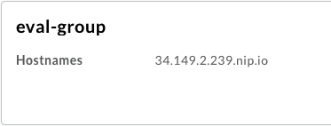

### Create Okta User

1. Sign into your Okta developer portal
2. In the left hand side  navigate to Directoy - People
3. Click on **Add person**
     - A valid email is not needed if the Password is set by Admin

     
4. Click **Save**

### Create Okta App

1. In the left hand side navigate to Applications - Applications
2. Click on **Create App Integration**
3. In the window that opens, selecte OIDC - OpenID Connect and Web Application and click **Next** to create the App

     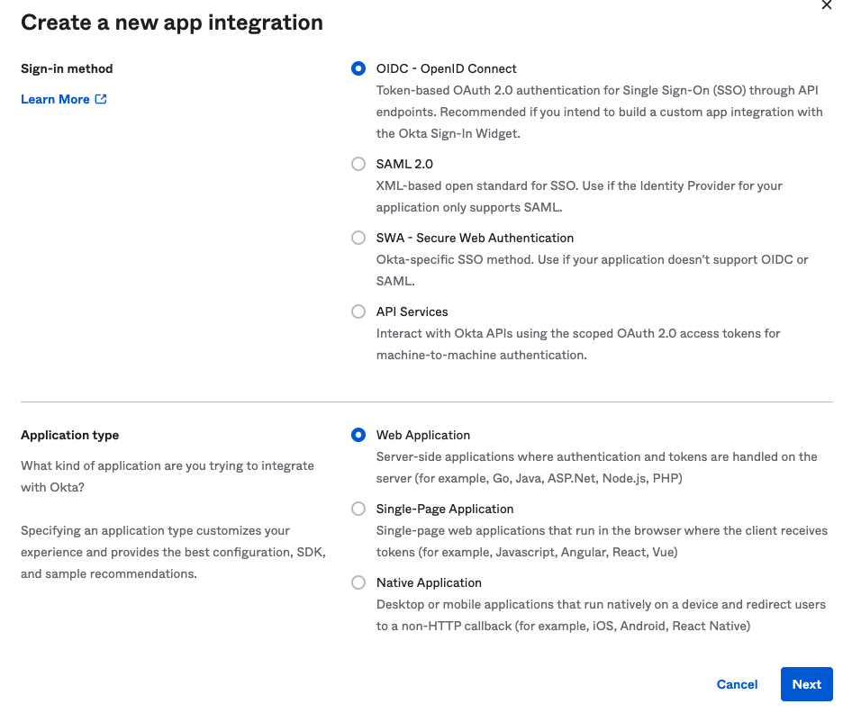

4. In the next screen, configure the following

     - App integration name: Apigee App
     - Sign-in redirect URIs:

          ```text
          https://{env group hostname}/v1/oauth20/callback 
          ```

     - example:

          ```text
          https://34.149.2.239.nip.io/v1/oauth20/callback
          ```

     - This url points to the idp facade that will be deployed to Apigee
     - Controlled access: Allow everyone

     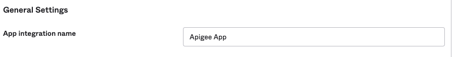
     
     

5. Click **Save** to be taken to the properties of the Okta app just created

     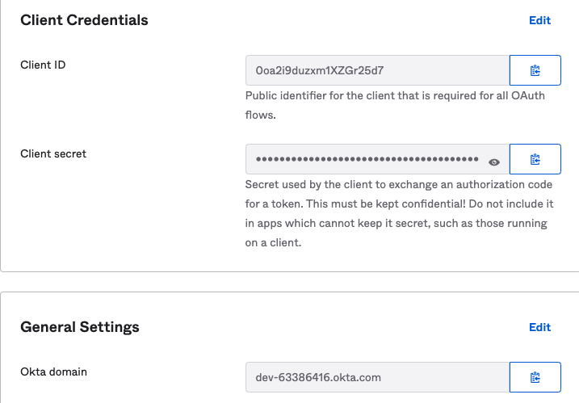

6. Save the client ID, client secret, and Okta domain as environment variables

     ```bash
     export TEST_IDP_APIGEE_CLIENT_ID={Client ID above}]
     export TEST_IDP_APIGEE_CLIENT_SECRET={Client Secret above}
     export IPD_HOSTNAME={Okta domain above}
     ```

## Identity Facade Setup

1. In a command line, clone the [devrel repo](https://github.com/apigee/devrel)

     ```bash
     git clone https://github.com/apigee/devrel.git
     ```

2. Navigate to the identity facade directory

     ```bash
     cd devrel/references/identity-facade
     ```

3. Run the following commands to set the environment variables required for the setup

     ```bash
     export IDP_DISCOVERY_DOCUMENT="https://$IPD_HOSTNAME/.well-known/openid-configuration"
     export APIGEE_X_ORG={your org name}
     export APIGEE_X_ENV={Apigee environment name. Default is eval}
     export APIGEE_X_HOSTNAME={your Apigee hostname ex:34.149.2.239.nip.io)
     ```

4. Verify the variables have been set correctly

     ```bash
     echo $IDP_DISCOVERY_DOCUMENT
     echo $TEST_IDP_APIGEE_CLIENT_ID
     echo $TEST_IDP_APIGEE_CLIENT_SECRET
     echo $APIGEE_X_ORG
     echo $APIGEE_X_ENV
     echo $APIGEE_X_HOSTNAME
     ````

5. Deploy the identity facade

     ```bash
     ./pipeline.sh --googleapi
     ```

     - The output is shown below. The values for consumerKey and consumerSecret are from the Apigee identityApp that was created as part of the Identity Facade deployment.
          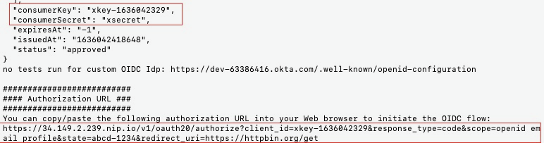

6. Copy and save the following values:

     - consumerKey
     - consumerSecret
     - authorization URL

7. Finally, generate environment variables for use later.

     - Base64 encoding of client id and secret for use during Basic Auth in tests

     ```bash
     export APIGEE_CLIENT_ID={consumerKey above}
     export APIGEE_SECRET={consumerSecret above}
     export BASE64_ENCODED=$(echo -n $APIGEE_CLIENT_ID:$APIGEE_SECRET | base64)
     ```

## Test Identity Facade

This test will simulate a three-legged [OAuth 2.0](https://cloud.google.com/apigee/docs/api-platform/security/oauth/oauth-introduction) flow / authorization grant

1. Open an incognito tab in a browser and visit the **authorization URL** captured above

     - This step simulates an application attempting to authenticate against the Apigee Identity Facade.
     - You can generate the authorization url using the command below.

     ```bash
     export AUTH_URL="https://$APIGEE_X_HOSTNAME/v1/oauth20/authorize?client_id=$APIGEE_CLIENT_ID&response_type=code&scope=openid email profile&state=abcd-1234&redirect_uri=https://httpbin.org/get"
     echo $AUTH_URL
     ```

2. Apigee will redirect to Okta to generate an authorization code. Log in using the Okta credentials for the user created earlier.

     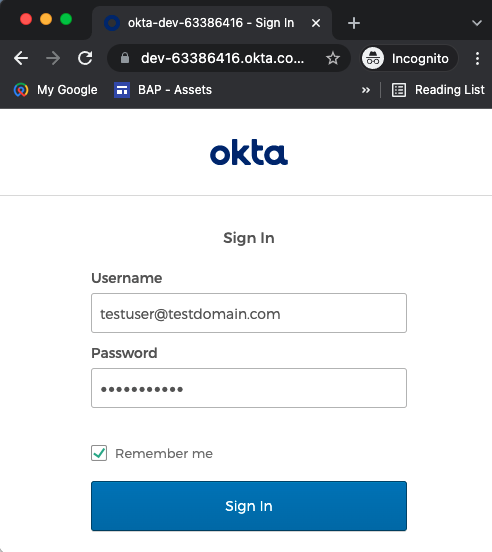

3. After successful authentication, Okta redirects to the Apigee callback URL (/v1/oauth20/callback), which controls the incoming query parameters, generate an authorization code (using the same value as the one provided by Okta) and performs a redirection on the client app redirect_uri `https://httpbin.org/get` providing the authorization_code and initial state parameters.

     - In a real-world scenario, the redirection would be back to the client application and it would parse Okta's response to capture the authorization code

     

4. Pass the authorization code, client id, and base64 encoded string to Apigee Identity Facade to generate a Bearer token that will be used for API calls.

     ```bash
     export AUTH_CODE={authorization code returned above}
     export APIGEE_RESPONSE=$(curl -s --location --request POST "https://$APIGEE_X_HOSTNAME/v1/oauth20/token?client_id=$APIGEE_CLIENT_ID" \
     --header "Authorization: Basic $BASE64_ENCODED" \
     --header 'Content-Type: application/x-www-form-urlencoded' \
     --data-urlencode 'redirect_uri=https://httpbin.org/get' \
     --data-urlencode 'grant_type=authorization_code' \
     --data-urlencode "code=$AUTH_CODE")
     echo $APIGEE_RESPONSE
     export ACCESS_TOKEN=$(echo $APIGEE_RESPONSE | jq -r .access_token)
     echo $ACCESS_TOKEN
     ```

5. Apigee will respond with a Bearer token (access_token) which is saved to an environment variable

6. Finally, call an endpoint protected by OAuth. The identity facade has /protected one configured to validate OAuth tokens.

     ```bash
     curl --location --request GET "https://$APIGEE_X_HOSTNAME/v1/oauth20/protected" \
     --header "Authorization: Bearer $ACCESS_TOKEN"
     ```

     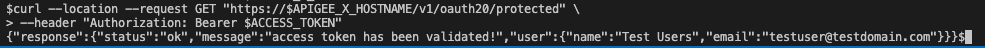

## Use Identity Facade with API Proxy

The default Apigee install includes a /hello-world proxy. In this section we will add an OAuthv2 policy that verifies the access token and create an application that has access to the identity facade (generate tokens) and the Hellow-World proxies.

1. In the Apigee portal, expand Publish and click on API Products.
2. Choose + CREATE
3. Fill in the following

     - Name: Hellow World
     - Display Name: Hello World
     - Environment: eval
     - Access: Public
     - Operations (ADD AN OPERATION)
     - API Proxy: hello-world
     - Path: /
     - Save
     - Scroll up and click Save

     
     

4. Under Public, click on Apps.

     - Notice there is an app created called identity app. The client id and secret used above are from this application.

5. Click on +App and configure it as follows:

     - Name: Hello World App
     - Developer: Jane Doe (this user was also created during the identity facade deployment)
     - Productt:
     - Hello World
     - Identity Facade

     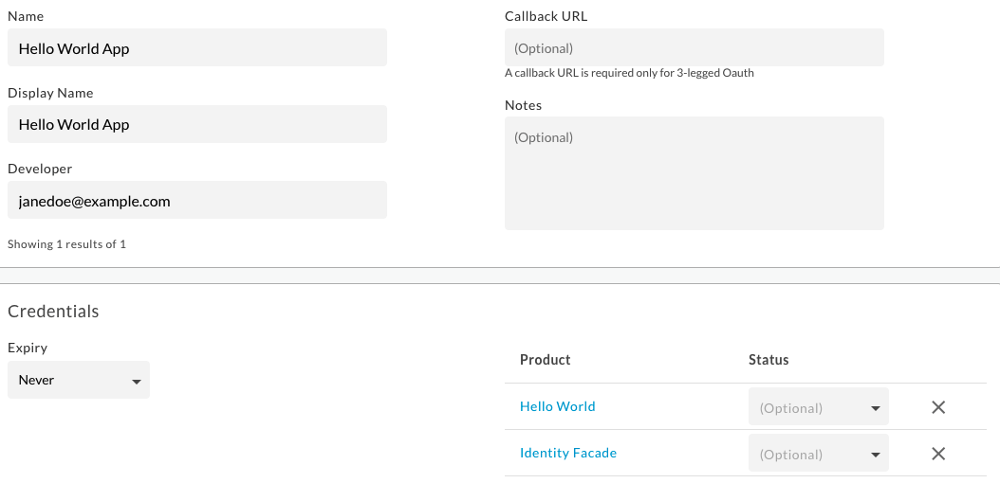

6. Click Create
7. Copy the values for Key (client ID) and Secret

     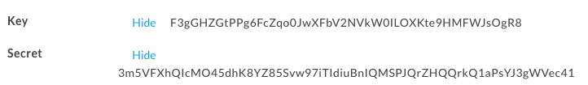

8. the environment variables

     ```bash
     export APIGEE_CLIENT_ID=F3gGHZGtPPg6FcZqo0JwXFbV2NVkW0ILOXKte9HMFWJsOgR8
     export APIGEE_SECRET=3m5VFXhQIcMO45dhK8YZ85Svw97iTIdiuBnIQMSPJQrZHQQrkQ1aPsYJ3gWVec41
     export BASE64_ENCODED=$(echo -n $APIGEE_CLIENT_ID:$APIGEE_SECRET | base64)
     export AUTH_URL="https://$APIGEE_X_HOSTNAME/v1/oauth20/authorize?client_id=$APIGEE_CLIENT_ID&response_type=code&scope=openid email profile&state=abcd-1234&redirect_uri=https://httpbin.org/get"
     echo "$AUTH_URL"
     ```

     

9. Like before, visit the $AUTH_URL in a browser

     - Authenticate as testuser@testdomain.com
     - Copy the authorization code from the response

     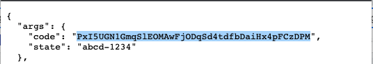

10. Run through the remaning authentication and API call steps

     ```bash
     export AUTH_CODE={authorization code returned above}
     export APIGEE_RESPONSE=$(curl -s --location --request POST "https://$APIGEE_X_HOSTNAME/v1/oauth20/token?client_id=$APIGEE_CLIENT_ID" \--header "Authorization: Basic $BASE64_ENCODED" \
     --header 'Content-Type: application/x-www-form-urlencoded' \
     --data-urlencode 'redirect_uri=https://httpbin.org/get' \
     --data-urlencode 'grant_type=authorization_code' \
     --data-urlencode "code=$AUTH_CODE")

     export ACCESS_TOKEN=$(echo $APIGEE_RESPONSE | jq -r .access_token)

     curl --location --request GET "https://$APIGEE_X_HOSTNAME/hello-world" \
     --header "Authorization: Bearer $ACCESS_TOKEN"
     ```

     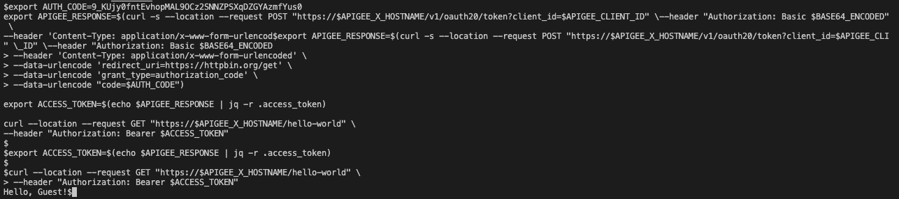

## Summary

Congratulations! You've now successfully integrated your Apigee environment with a 3rd party IDP, Okta, and secured your API using OAuthv2 tokens.
