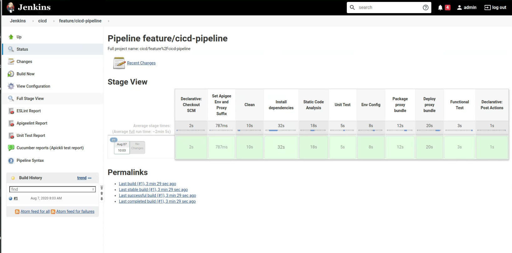

# CICD Pipeline

This project contains an reference implementation for a CI/CD pipeline for
Apigee using the [Apigee Deploy Maven
Plugin](https://github.com/apigee/apigee-deploy-maven-plugin).

The CICD pipeline consists of:

- Git branch dependent Apigee environment selection and proxy naming to allow
  deployment of feature branches as separate proxies in the same environment
- Static code analysis using [eslint](https://eslint.org/)
- Unit testing using [mocha](https://mochajs.org/)
- Packaging and deployment of the API proxy bundle using
  [Apigee Deploy Maven Plugin](https://github.com/apigee/apigee-deploy-maven-plugin)
- Integration testing of the deployed proxy using
  [apickli](https://github.com/apickli/apickli)

It also contains an example configuration for running the CI/CD
pipeline in an orchestration tool:

- Using fully managed Google Cloud Build for Apigee X/hybrid and Edge
- Using a self-managed Jenkins Server for Apigee Edge

## Development

- Install dependencies:

  ```sh
  npm install
  ```

- Unit testing:

  ```sh
  npm run unit-test
  ```

- Integration testing against host `$APIGEE_ORG-$APIGEE_ENV.apigee.net` and
  default basepath `airports-cicd/v1`:

  ```sh
  TEST_HOST=$APIGEE_ORG-$APIGEE_ENV.apigee.net npm run integration-test
  ```

- Integration testing against feature branch deployment on
  `airports-cicd-feature-ABC/v1`:

  ``` sh
  TEST_HOST=$APIGEE_ORG-$APIGEE_ENV.apigee.net TEST_BASE_PATH='/ airports-cicd-feature-ABC/v1' npm run integration-test
  ```

## Initialize a Git Repository

Create a Git repository to hold your API Proxy.
You can either create a Google Source repository

```sh
gcloud services enable sourcerepo.googleapis.com
export REPO_NAME="apigee-cicd-demo"
gcloud source repos create $REPO_NAME
GIT_URL=$(gcloud source repos describe $REPO_NAME --format="value(url)")
```

or create a GitHub repository

```sh
GIT_URL='https://github.com/ORG/REPO.git'
```

```sh
cd devrel/references/cicd-pipeline
git init
git remote add origin $GIT_URL
git checkout -b feature/cicd-pipeline
git add .
git commit -m "initial commit"
git push -u origin feature/cicd-pipeline
```

## Orchestration using Run Cloud

The instructions below explain how to trigger an Apigee CI/CD pipeline manually
via the gcloud command and via a push trigger on a Google Source Repository.
Similarly push triggers can also configured on other Git repositories.

### Apigee hybrid / Apigee X

Requires the Cloud Build API to be enabled and a Service Account with the
following roles (or a custom role with all required permissions):

- Apigee API Admin
- Apigee Environment Admin

```sh
gcloud services enable cloudbuild.googleapis.com
PROJECT_ID=$(gcloud config get-value project)
PROJECT_NUMBER=$(gcloud projects describe $PROJECT_ID --format="value(projectNumber)")
CLOUD_BUILD_SA="$PROJECT_NUMBER@cloudbuild.gserviceaccount.com"

gcloud projects add-iam-policy-binding "$PROJECT_ID" \
  --member="serviceAccount:$CLOUD_BUILD_SA" \
  --role="roles/apigee.environmentAdmin"

gcloud projects add-iam-policy-binding "$PROJECT_ID" \
  --member="serviceAccount:$CLOUD_BUILD_SA" \
  --role="roles/apigee.apiAdmin"
```

Configure the (externally reachable) hostname of your Apigee environment
for the integration test:

```sh
APIGEE_ORG="$PROJECT_ID"
APIGEE_ENV=test1
APIGEE_HOSTNAME=api.my-host.example.com
```

Run the deployment (with a simulated git branch name)

```sh
gcloud builds submit --config='./ci-config/cloudbuild/cloudbuild.yaml' \
  --substitutions="_API_VERSION=google,_DEPLOYMENT_ORG=$PROJECT_ID,_APIGEE_TEST_ENV=$APIGEE_ENV,_INT_TEST_HOST=$APIGEE_HOSTNAME,BRANCH_NAME=experiment"
```

Or set up a push-trigger for the Google source repository

```sh
gcloud beta builds triggers create cloud-source-repositories \
    --repo="$REPO_NAME" --branch-pattern='.*' --name="cicd-example" \
    --build-config='ci-config/cloudbuild/cloudbuild.yaml' \
    --substitutions="_API_VERSION=google,_DEPLOYMENT_ORG=$PROJECT_ID,_APIGEE_TEST_ENV=$APIGEE_ENV,_INT_TEST_HOST=$APIGEE_HOSTNAME"
```

### Apigee Edge

Requires the Cloud Build API to be enabled and a Service Account with the
following role:

- Secret Manager Secret Accessor

```sh
gcloud services enable secretmanager.googleapis.com cloudbuild.googleapis.com

PROJECT_ID=$(gcloud config get-value project)
PROJECT_NUMBER=$(gcloud projects describe $PROJECT_ID --format="value(projectNumber)")
CLOUD_BUILD_SA="$PROJECT_NUMBER@cloudbuild.gserviceaccount.com"

gcloud projects add-iam-policy-binding "$PROJECT_ID" \
  --member="serviceAccount:$CLOUD_BUILD_SA" \
  --role="roles/secretmanager.secretAccessor"
```

To pass the Apigee user and password securely into the Cloud Build pipeline you
have to add these two secrets to the cloud secret manager:

- `devrel_apigee_user` that holds the user to use for the CI/CD account
- `devrel_apigee_pass` that holds the password for the CI/CD account

```sh
echo "$APIGEE_USER" | gcloud secrets create devrel_apigee_user --data-file=-
echo "$APIGEE_PASS" | gcloud secrets create devrel_apigee_pass --data-file=-
```

Run the deployment (with a simulated git branch name)

```sh
gcloud builds submit  --config=./ci-config/cloudbuild/cloudbuild.yaml --substitutions="_API_VERSION=apigee,_INT_TEST_HOST=$APIGEE_ORG-$APIGEE_ENV.apigee.net,_DEPLOYMENT_ORG=$APIGEE_ORG,BRANCH_NAME=experiment"
```

Or set up a push-trigger for the Google source repository

```sh
gcloud beta builds triggers create cloud-source-repositories \
    --repo="$REPO_NAME" --branch-pattern='.*' --name="cicd-example-edge" \
    --build-config='ci-config/cloudbuild/cloudbuild.yaml' \
    --substitutions="_API_VERSION=apigee,_DEPLOYMENT_ORG=$APIGEE_ORG,_APIGEE_TEST_ENV=$APIGEE_ENV,_INT_TEST_HOST=$APIGEE_ORG-$APIGEE_ENV.apigee.net"
```

## Orchestration using Jenkins

*Note:* Currently this Jenkins reference is designed for Apigee Edge only.

### Requirement: Jenkins Server

You can either use the included instructions to configure a new Jenkins server
or use your existing infrastructure. The `jenkins-build` folder contains instructions
on how to set up a dockerized Jenkins environment with all the necessary
tooling and plugins required.

#### Option A: Run a Jenkins Docker Container

See the instructions in [./jenkins-build/README.md](./jenkins-build/README.md).

#### Option B: Use an existing Jenkins Setup

If you already have a current (version 2.200+) Jenkins instance you can also
use that one.

You are responsible to ensure you have the following plugins enabled:

- [Multibranch Pipeline](https://plugins.jenkins.io/workflow-multibranch/)
- [HTML Pubisher](https://plugins.jenkins.io/htmlpublisher/)
- [Cucumber Reports](https://plugins.jenkins.io/cucumber-reports/)

### CI/CD Configuration Instructions

#### Jenkins Configuration / Start

Start or configure your Jenkins server as described above.

### Create a multibranch Jenkins job

Use the UI to configure the Jenkins Job for multibranch pipelines:

1. Set the Git repo e.g. `https://github.com/my-user/my-api-proxy-repo`
2. Path to the Jenkinsfile e.g. `ci-config/jenkins/Jenkinsfile`
3. (Optional) Set the build trigger / polling frequency


### Run the pipeline

1. Open the multi-branch pipeline you just created.
2. Click `Scan Multibranch Pipeline Now` to detect branches with a
    Jenkinsfile.
3. Explore the build(s) that get triggered.
4. Explore the final build success.



### Promote to different stages and environments (feature/test/prod)

1. Explore the newly created api-proxy in the test environment that
    corresponds to the feature branch
2. Merge the feature branch into `main` branch and explore the promotion into
    the Apigee test environment
3. Merge the `main` branch into the `prod` branch and explore the promotion
    into the Apigee prod environment

## Limitations

- The authentication to the Apigee management API is done using OAuth2. If
  you require MFA, please see the [documentation](https://github.com/apigee/apigee-deploy-maven-plugin#oauth-and-two-factor-authentication)
  for the Maven deploy plugin for how to configure MFA.
