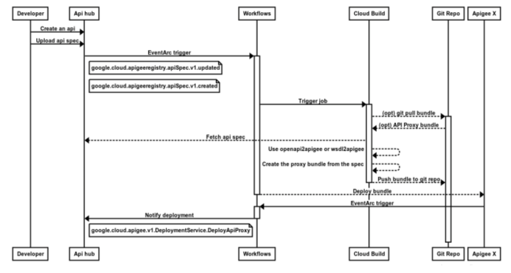

# Workflow-based automation for Apigee X using API Hub and EventArc

A common use-case for integrating Apigee with Api-Hub using EventArc and Workflows.
We are sharing the required artifacts and providing the details on the step-by-step process of a fictitious real production deployment together with all the concepts and corresponding design choices. We want you to also get up and running in your project implementation with minimum changes or take inspiration and further customize this solution according to your needs.
Apigee API hub enables you to consolidate and organize information about all of the APIs in your company's organization. It includes APIs at all stages of their lifecycle, from design and implementation through deprecation and retirement. This allows developers to discover and leverage the work of other teams wherever possible. It also allows API platform teams to better manage their portfolio of APIs.
The API hub experience is primarily aimed at consumers and producers of APIs within an organization whose main concerns are finding and listing APIs in their organization's catalog.
API hub acts as a frontend for the API Registry to view and manage your organization's APIs. Permissions in the API hub and API Registry are controlled through Google Cloud IAM.   
Even if API hub is a relatively new addition to the family of products under the Apigee API management umbrella, it has already seen a significant interest by customers and system integrators, especially in large enterprises that have a clear need to organize, maintain and publish the company wide API catalogs. Such catalogs can easily grow to hundreds and even thousands of APIs; it is therefore a natural choice to study the best way to automate the creation of  API proxies, their versioning, their deployment and the synchronization of their deployment status and latest revision to the catalog maintained and published in the API hub.
We will show how Google Cloud is well equipped to provide an answer to the need for complete automation of the full lifecycle of these APIs, reliably and at scale.
We will specifically look at automating the deployment workflow of APIs for which the development team is wishing to author and maintain the corresponding WSDL definitions of the SOAP-based backend interfaces and also REST APIs with their corresponding OpenAPI specifications; in fact they want to use these API definitions to autonomously generate the API proxy bundles and corresponding artifacts, with the objective of letting these govern the API gateway behavior.
Obviously customers want to include autonomous deployment, minimal (i.e. zero) human intervention to prepare the proxy bundles at scale, increment their versions in correspondence of changes to the definitions, store the API proxy bundles and the corresponding versioning metadata in source code repositories  and automatically publish the most up-to-date and accurate API deployment information to the API Hub console and API registry.
We assume that by now you can immediately grasp the benefits of achieving this with full automation, at scale: it saves time, removes human errors, allows API administrators to revert back quickly a previous version of the definitions in case of problems with the new version while reducing chores. It also guarantees that all API consumers (both within the organization and  external, according to the exposure profile and permissions for the API Hub and API Registry) are never ever presented with inaccurate, incomplete or obsolete information about the overall deployment status of the APIs in the Apigee X runtime.

## Approach description
We present the full automation and orchestration approach starting from the creation of APIs from their specifications using only cloud native tools. The most important one that allows to prepare a full event driven Google Cloud solution  is EventArc. Both API Hub and Apigee X can natively emit signals (called trigger) to EventArc when specific events happen. Full documentation is published for them and their references are included at the end.
We will describe how to leverage API Hub, Google Cloud Workflows, Apigee X management APIs and the corresponding events generated by EventArc to provide the triggering events for the Workflows and implement full orchestration.
Although the creation of API bundles from the SOAP WSDL definition (alternatively for REST endpoints: OpenAPI specifications) of the target backend interfaces is proposed as the first step of the automation chain, it is provided as an example. It leverages open source components that have already been developed and open sourced to handle this scenario and we want to present it for the sake of completeness. These tools have also been extended to support additional use cases and you will find the references and links to their corresponding Github repositories in a dedicated section at the bottom. You are clearly free to use the orchestration approach proposed here in more diverse use cases.
Integration and synchronization with Cloud Source repositories, GitHub or GitLab or a different source code management tool is also highly desirable and we will also show an example of this as part of this reference solution description.
We will always reference the Apigee X API management platform, but it is worth noting the automation approach we are proposing is far more generic and is the same for customers who opted for the Apigee hybrid deployment option instead of X. Moreover Apigee API Hub does and its API registry are not meant to be used only by Apigee API management customers: it is intended to provide a convergent and unified API documentation hub and registry for customers relying on solutions from different commercial API gateways, bespoke home grown solutions and even heterogeneous multiple vendors. It is meant as a transparent unification layer and the first consolidation step towards the migration to Apigee in large API-first enterprise transformation projects.  

## High level design

### Step 1: An API Developer creates or updates an API in the API hub
Customers have shown a great interest in automating at scale the publication of API proxies in their fully managed Apigee X organization in correspondence of the publication from the developers of the specifications docs onto the Apigee API hub; the API proxies could be generated autonomously either as pass-through proxies (or as compliant and pre-populated by a given set of pre-configured Policy configurations and even a standard template including flow callouts to common organization and/or environment level resources).
We want to define a sequence of events that can be autonomously generated and handled in occurrence of each. These events correspond to the first entry point for the API hub emitting an EventArc trigger when an API developer interacts with the API hub user interface; we will describe what happens next in Step 2.
For simplicity, the high level detail above shows the scenario where the API Proxy bundle being a straightforward pass-through proxy, i.e. the proxy bundle does not exist yet and does not need to be retrieved in advance of its manipulation (it is simply created without policies) from the GIT Repository.

### Step 2: API Hub emits an EventArc trigger
API Hub emits an EventArc trigger event upon one of the configured events that we want an automation task to act upon (according to step 1); we will describe in greater detail in the following steps what actions are initiated according to such conditions being met. Each individual trigger event will initiate a new instance of the Workflows execution.

### Step 3: An instance of GCP Workflows is started
All orchestration presented here is easily implemented using configuration in Google Cloud Workflows. The workflow engine is serverless and runs in Google Cloud; it is hence a cloud native tool that can be configured to initiate workflows on receiving an EventArc specific trigger. Workflows is configured to initiate when the EventArc trigger coming from API Hub on new events corresponding  to either:
the creation of a new API in API Hub starting from its SOAP WSDL or OpenAPI specs;
the update of an existing API in API Hub, when a new version for its OpenAPI specs have been uploaded or - for example - when the corresponding SOAP WSDL file has been amended with a new version (or, for REST API endpoints, a different OpenAPI specification file is uploaded).
Also note that an alternative (separate) entry point for the orchestration pipelines described in this article is the publication from an authorized Apigee API management console (at https://apigee.google.com) user of either a new API proxy or a new version of an existing API proxy.
An example  using the Google Cloud portal on how to configure at Step 2 a new trigger for the scenario described in Step 3.b is included below. Each corresponding new event will initiate a new instance of Workflows. Triggers can obviously be also configured via gcloud; this would be the optimal and recommended approach when using automation; how to do it is described here.

### Step 4: Cloud Build is invoked, the API bundle is pushed to Git
Cloud Build is responsible for preparing the proxy bundle, this is the one that will be deployed. Optionally (as described in this reference use case) additional open source tools will need to be invoked to prepare the API proxy bundle starting from the API spec that has been uploaded to the API Hub, which contains the OpenAPI specs of the proxy and the full WSDL of the SOAP interface for which the client wants to be able to automatically prepare a pass-though or more sophisticated API proxy. The open source tools used are also added to the additional resources section of this article and are openapi2apigee and wsdl2apigee. They are publicly available on github.com   
### Step 5: The API is deployed to Apigee X
Upon completion of the necessary build steps, the API proxy bundle and all relevant artifacts and dependencies for the deployment have been prepared according to the Workflows orchestration and the Cloud Build configuration. This step consists of invoking the Apigee Management APIs for the deployment to the target Organization and Environment of the versioned API proxy (either a new API proxy or a new version of an existing API proxy).  With a successful deployment, the Workflows orchestration job has now completed.
### Step 6: Apigee X emits a GCP EventArc trigger
Apigee X is able to emit EventArc events when an API proxy revision is created and when a new deployment is performed (see the referenced documentation for additional details). We use these upon both the following scenarios:

a) the successful deployment a new API proxy into a given target environment within a given Apigee X organization;

b) the successful deployment of a new version of an existing API proxy in a given Apigee X organization.

In both these cases, the trigger will carry information on the organization, the environment, the name of the proxy bundle, the proxy bundle version, additional relevant metadata (for example, the requester of the deployment).

This approach creates a separate (the second, separate) entry point for the orchestration and automation pipeline built with GCP Workflows. It is a cloud native pipeline and does not rely on external dependencies.  

### Step 7: A new separate instance of GCP Workflows is started
This step is necessary to complete the final publication event onto the API Hub, so that it is always kept in sync with the correct and most up-to-date list of APIs deployed onto the Apigee X organization, so that the API catalog is kept in sync with the state of the API runtime gateway.
There is one major benefit of this approach: Workflows instances will be triggered autonomously also when a new API proxy deployment (or an API proxy deployment of a new version) is performed by an operator (with sufficient privileges) via the Apigee Management UI  or by another independent automation service account, still with enough machine user privileges (for example, an independent automation pipeline being executed by another existing build & deploy process).

### Step 8 (final): GCP Workflows notifies API Hub of the API deployment   
As anticipated in the description of the Step 7, this represents the final step and this is the one that guarantees that the most up-to-date list and version of each published API in the API runtime gateway for the corresponding organization is presented to all (via UI and automation) users of the API hub. The Workflow has its own error handling logic, it is asynchronous and has eventual consistency design patterns so that even in case the API hub has a problem in receiving the notification immediately, this will not be discarded.

## Reference description
In the reference you will find tho directories:

- /cloud-builder: it contains a custom builder for Google Cloud build that add all the tools required for the automation workflow to the Debian 11 container image
- /workflows: it contains the Google Cloud Workflow templates that implement the two case of automation 

## External tools

- [openapi2apigee](https://github.com/apigee/openapi2apigee) - An open source project that converts a standard Open API spec (previously known as Swagger) into an Apigee API Proxy bundle and deploys into an Apigee Organization.
- [wsdl2apigee](https://github.com/apigee/wsdl2apigee) - An open source project that extends Apigee functionality to provide the ability to expose a SOAP Service as a REST API (over JSON or XML) or
  expose a SOAP Service in a pass through mode using a WSDL descriptor.

## License

All solutions within this repository are provided under the Apache 2.0 license. Please see the LICENSE file for more detailed terms and conditions.

## Contact
Questions, issues and comments should be directed to
[matteo.longo@soft.it](mailto:matteo.longo@soft.it).
