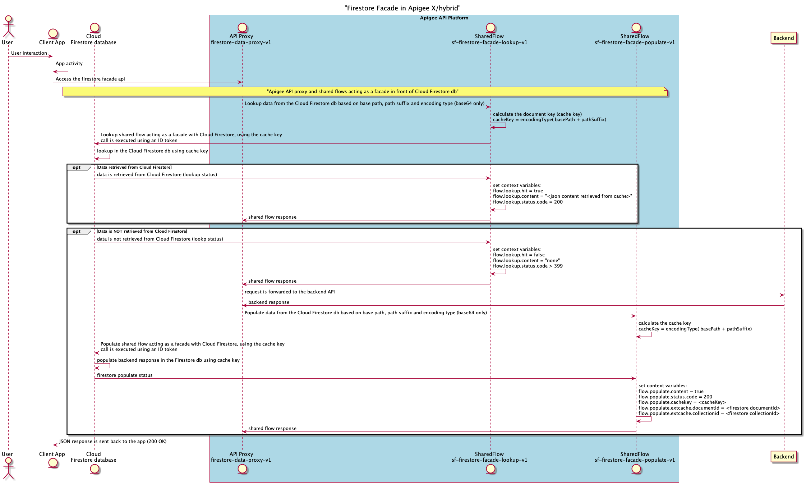
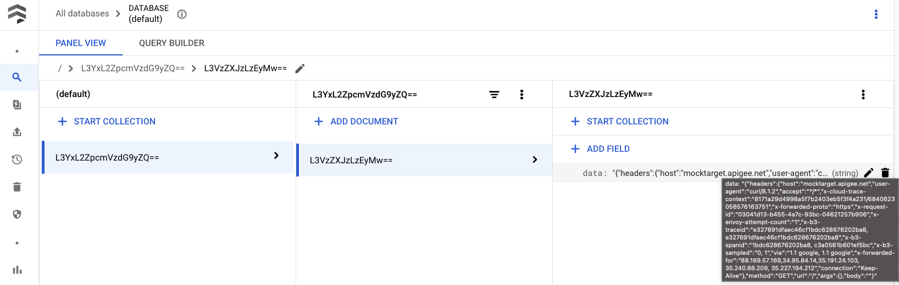

# Firestore Facade in Apigee X/hybrid

[Cloud Firestore](https://firebase.google.com/docs/firestore)
is a flexible, scalable database for mobile, web, and server development
from Firebase and Google Cloud.
Apigee can act as a facade in front of Cloud Firestore, to implement the
following use cases:

- Long term storage: using Cloud Firestore to cache data on long term
- Data as a Service (DaaS) pattern: some data of a Cloud Firestore database
(db) are exposed as an API

The use case that is proposed in the Firestore facade reference is the one
based on long term storage.
Indeed, in situations where you need a caching mechanim for data,
which must be cached for more than 30 days (max TTL for caching data in
Apigee X) a storage solution is required.
Cloud Firestore is the perfect solution to consider in case of long
term storage needs.

## How it works?

Two Apigee **sharedflows** are used as a facade in front of a Cloud Firestore
db. A **key cache** is used to lookup and populate data into the Cloud
Firestore db.

By default, the key cache is defined as the following:

```keyCache = base64Encoding(basePath + '/' + pathSuffix)```

This can be modified depending on the use case you need to implement

The 2 Shared Flows on Apigee, acting as a facade in front of a Cloud
Firestore db are:

- ```sf-firestore-facade-lookup-v1```: to lookup into a Cloud Firestore db
- ```sf-firestore-facade-populate-v1```: to populate a Cloud Firestore db
with backend responses

## Apigee runtime options

The Firestore facade reference can be deployed on both Apigee X and
hybrid. This reference would also work with Apigee Edge if the Service Account
token is obtained through the sharedflows, which invoke the Cloud Firestore
API endpoint (```sf-firestore-facade-lookup-v1``` and
```sf-firestore-facade-populate-v1```).

## Dependencies

- [Maven](https://maven.apache.org/)
- [NodeJS](https://nodejs.org/en/) LTS version or above
- An Apigee organization
- [Google Cloud Platform](https://cloud.google.com/) (GCP)

This reference leverages Apigee and Cloud Firestore.
Therefore, it is important to note that:

- A GCP service account is needed by the Apigee configuration
to securely invoke the Cloud Firestore API endpoint.
This service account is created during the deployment process on the GCP
project you are currently using: the ```pipeline.sh``` will attempt to create
a service account only if it doesn't exist.

In case you want to create this service account manually - or with Terraform,
please note that the role ```roles/firestore.admin``` must be granted
to it.

## Quick start

### Apigee X / hybrid

    export APIGEE_X_ORG=xxx
    export APIGEE_X_ENV=xxx
    export APIGEE_X_HOSTNAME=xxx

    ./pipeline.sh

## Deployment options

There are 2 options to deploy the Firestore facade reference.

```Option 1``` is the default deployment option.

### Option 1: Cloud Firestore is mocked

    export IS_FIRESTORE_MOCK_ENABLED=true

With this option (*default*) no Cloud Firestore db is
invoked but a mock response similar to a real one is delivered.

**Functional tests are executed only when this deployment option is
selected**.

### Option 2: Cloud Firestore is used

    export IS_FIRESTORE_MOCK_ENABLED=false

With this option, it is not possible to execute functional tests.
Nevertheless, you can request the Firestore facade API using the
HTTP client of your choice.

## Script outputs

The pipeline script deploys on Apigee X / hybrid two
**sharedflows** (```sf-firestore-facade-lookup-v1```
and ```sf-firestore-facade-populate-v1```)
containing the full configuration of the Firestore
facade reference.

An API Proxy, acting as a data proxy, is also part of the reference:

- ```firestore-data-proxy-v1```: a data proxy, which calls the two
**sharedflows** accordingly.

The target endpoint of this proxy is [mocktarget.apigee.net/echo](https://mocktarget.apigee.net/echo)

## Cloud Firestore & Apigee Sequence Diagram

The following sequence diagram provides all the interactions between:

- End-user
- Client app
- Apigee: sharedflows and data proxy
- Cloud Firestore
- Backend

This sequence diagram is available as a
[text file](./diagram/sequence-firestore-facade.txt).

If needed, you can modify this file and re-generate the related picture (png)
using the following command:

    ./generate_docs.sh

Here is the original sequence diagram:



## Testing the Firestore facade reference

In order to test this reference, you need an HTTP client.
If you execute your test using a real Cloud Firestore db, you have to create
it on your Google Cloud platform. You can use the ```(default)``` database.

### cURL command

Using cURL, the request is the following:

    curl https://${APIGEE_X_HOSTNAME}/v1/firestore/users/123

You can then access your Cloud Firestore instance to check that data (response
of the Apigee Mock API) have been insterted into your Cloud Firestore db (
cf. **data** on the right side of the picture):



As you can notice, both ```basePath``` (**collectionId** in Cloud Firestore) and
```pathSuffix``` (**documentId** in Cloud Firestore) are base64 encoded.
