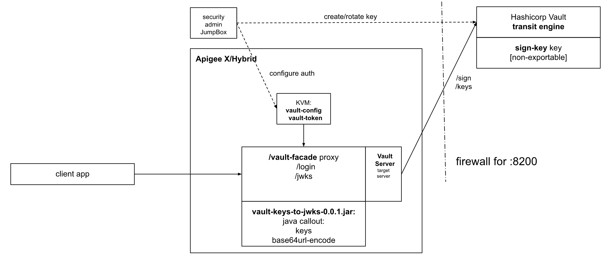

<!-- markdownlint-disable MD033 -->

# Apigee Proxy and HashiCorp Vault Integration

This repository demonstrates an interaction between an Apigee API proxy and HashiCorp Vault. The operation of signing JWT token is delegated to the Vault server that is used as an EaaS (Encryption as a Service) solution. The private key thus is locked in the Vault server and never exposed. The public keys used for signature verification are proxied from the Vault server and returned in a canonical JWKS format.

## Technical Setup

The vault-facade proxy exposes two endpoints:

- /jwks -- returns a collection of public keys so that a client can verify the signature;
- /login -- models a typical authentication endpoint that returns a JWT ID token.

The solution uses Java Callout to perform auxiliary operations of adding base64url encode operation, which is absent is Apigee templating functionality.

The second operation is transforming a public key from a PEM format published by Vault to JWKS format, expected by a client application.



## Deploy vs Mock Run

The *pipeline.sh* script can be used to deploy the solution in both scenarios: a mocked Vault server and a real Vault server.

The SKIP_MOCKING variable controls required changes and tweaks.

Here is the list of environment variable to set up to configure setup environment:

```sh
export APIGEE_X_ORG=<apigee-org>
export APIGEE_X_ENV=<apigee-env>

export APIGEE_X_HOSTNAME=<apigee-hostname>

export SKIP_MOCKING=Y

export VAULT_HOSTNAME=<vault-hostname>
export VAULT_PORT=<vault-port>
export VAULT_SSL_INFO=''

export VAULT_TOKEN=<vault-token>
```

Then run pipeline.sh script.

```sh
./pipeline.sh
```
