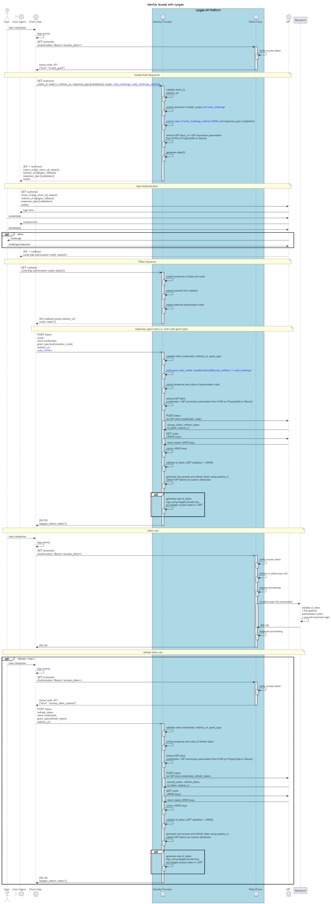

# Identity Facade

An identity facade that is used in front of an OpenID Connect (OIDC) compliant
Identity Provider (IdP).
The aim of the identity facade is to deal with all the interactions between a
client app and an IdP and to generate an OAuth20 access token that can be used
by the client app to access protected resources through Apigee.
This reference promotes a clear **separation of concerns** between Apigee and
the IdP.

- Apigee is responsible for **authenticating client apps**
- The IdP is incharge of **authenticating the end-users**

The IdP that is used is the [OIDC Mock IdP](../oidc-mock) but you may
use any OIDC compliant IdP. Should you use your own IdP solution, please
modify the value of the variable ```idp_discovery_document``` in the
```pipeline.sh``` script. This variable MUST point to the URL of the
discovery document of your IdP solution. 
Other values that need to be changed are values of the 2 following variables:

- ```TEST_IDP_APIGEE_CLIENT_ID```: the client_id Apigee can use to connect to
 the IdP
- ```TEST_IDP_APIGEE_CLIENT_SECRET```: the client_secret Apigee can use to
connect to the IdP

## Dependencies

- [Maven](https://maven.apache.org/)
- [NodeJS](https://nodejs.org/en/) LTS version or above
- Apigee Evaluation [Organization](https://login.apigee.com/sign__up)
- [OIDC Mock IdP](../oidc-mock)

## Quick start

    export APIGEE_ORG=xxx
    export APIGEE_ENV=xxx
    export APIGEE_USER=xxx
    export APIGEE_PASS=xxx
    ./pipeline.sh

## Identity Facade Sequence Diagram

The sequence diagram providing all the interactions between end-user,
web-browser, client app, Apigee (identity facade and data proxy), IdP and
backend is available as a [text file](./diagram/sequence-identity-facade-v1.txt)
If needed, you can modify this file and re-generate the related picture (png)
using the following command:

    ./generate_docs.sh

Here is the orginal sequence diagram:



### Indentity Facade Endpoints

Available endpoints are the following ones:

1. GET /authorize: to deal with the initiation of the authentication sequence
2. GET /callback: to deal with access token issuance
3. POST /token: to deal with access token issuance
4. GET /protected: to simulate access to a protected resource