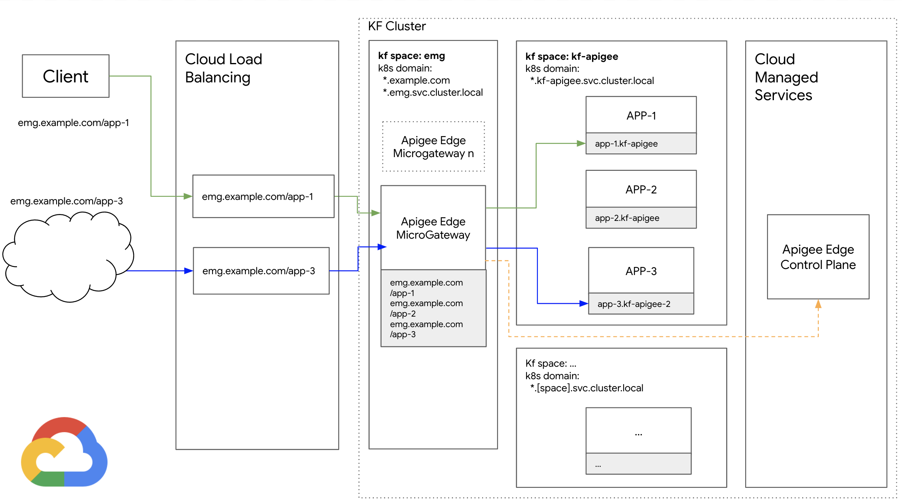

# GCP Kf + Apigee Edge MicroGateway

## Description

This is a sample architecture, and set of scripts for the deploying the Apigee Edge MicroGateway to a Kubernetes cluster with GCP Kf

## Architecture Overview

For this reference architecture there are two Kf spaces: **emg**, **kf-apigee**. The **"emg"** space hosts the Apigee Edge MicroGateway app. The **"kf-apigee"** space hosts 3 sample apps (httpbin) that the Apigee Edge MicroGateway (EMG) will route to.

## Requirements

* Kubernetes Cluster with [GCP Kf](https://cloud.google.com/migrate/kf/docs/latest/install-overview) installed
* Install Docker on your machine
* Install [envsubst](http://manpages.ubuntu.com/manpages/trusty/man1/envsubst.1.html) on your machine
* Build and install [emg-util](https://github.com/apigee/devrel/tree/main/tools/apigee-edgemicro-util) on machine

## Customizing the EMG Config

There are two template YAML files (emg-config-template.yml, emg-manifest-template.yml) that you can modify
to customize the deployment.

* **emg-manifest-template.yml** - This file controls the Kf App definition for the EMG
* **emg-config-template.yml** - This file controls the behavior of the EMG itself 

## Setup

1. Configure kf on your machine with credentials to your cluster
2. Create the **emg** and **kf-apigee** Kf spaces
3. Create an Apigee API product named **edgemicro_product**
4. Copy of the sample **env.sh** script (e.g. **env-[yourname].sh**).
5. Replace / populate the existing environment variables in your **env-[yourname].sh** 
6. Source your **env-[yourname].sh** environment
7. Make sure both **envsubst**, and **emg-util** are both in the $PATH
8. Build and push the EMG container to your container registry (see [emg-docker](emg-docker/build.sh) )
9. Run the deploy.sh script

