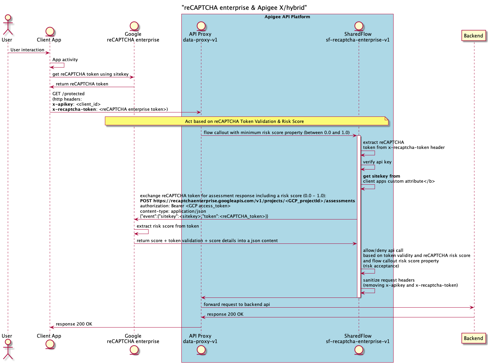

# reCAPTCHA Enterprise & Apigee X/hybrid

[Google reCAPTCHA Enterprise](https://cloud.google.com/recaptcha-enterprise)
can be leveraged by Apigee in order to protect backend systems from fraudulent
client side activities like **bots**.
A reCAPTCHA token is silentely and periodically retrieved by a client app and
transmitted to an Apigee runtime when an API is invoked.

## How it works?

The sharedflow configuration - that is proposed through this Apigee devrel
reference - is able to get a reCAPTCHA token validation status and a risk score
from the Google reCAPTCHA Enterprise assessment endpoint.
The risk score is a decimal value between ```0.0``` and ```1.0```.

The score ```1.0``` indicates that the interaction poses low risk and is very
likely legitimate, whereas ```0.0``` indicates that the interaction poses high
risk and might be fraudulent. Between both extremes, the sharedflow's
processing decides if an API invocation must be rejected or not.
The minimum score to consider an API call as legitimate is set at ```0.6```:
this value is configurable.

## Apigee runtime options

The reCAPTCHA enterprise reference can be deplopyed on both Apigee X and
hybrid.

## Dependencies

- [Maven](https://maven.apache.org/)
- [NodeJS](https://nodejs.org/en/) LTS version or above
- Apigee Evaluation/Trial [Organization](https://login.apigee.com/sign__up)
- [Google Cloud Platform](https://cloud.google.com/)

This reference leverages Google reCAPTCHA Enterprise. Therefore, a Google
Cloud Platform (GCP) service account is needed by the Apigee configuration
to securely invoke the Google reCAPTCHA Enterprise assessment endpoint.

This service account is created during the deployment process on the Google
Cloud project you are currently using.

## Quick start

### Apigee X / hybrid

    export APIGEE_X_ORG=xxx
    export APIGEE_X_ENV=xxx
    export APIGEE_X_HOSTNAME=api.example.com
    export GCP_PROJECT=your-gcp-project

    ./pipeline.sh

## Deployment options

There are 2 options to deploy the reCAPTCHA enterprise reference.

```Option 1``` is the default deployment option.

### Option 1: reCAPTCHA Enterprise is mocked

    export IS_RECAPTCHA_MOCK_ENABLED=true

With this option (*default*) the reCAPTCHA enterprise assessment is not
invoked but a mock response similar to a real one is delivered.
In this case, the risk score is based on the reCAPTCHA token that is
transmitted through the ```X-Recaptcha-Token``` HTTP header.

Here are the possible values for the mock reCAPTCHA token, the related risk
score and token validity:

| X-Recaptcha-Token | Risk Score | is Token Valid? |
| - | - | - |
| X-RECAPTCHA-TOKEN-0     | 0    | yes |
| X-RECAPTCHA-TOKEN-0.1   | 0.1  | yes |
| X-RECAPTCHA-TOKEN-0.2   | 0.2  | yes |
| X-RECAPTCHA-TOKEN-0.3   | 0.3  | yes |
| X-RECAPTCHA-TOKEN-0.4   | 0.4  | yes |
| X-RECAPTCHA-TOKEN-0.5   | 0.5  | yes |
| X-RECAPTCHA-TOKEN-0.6   | 0.6  | yes |
| X-RECAPTCHA-TOKEN-0.7   | 0.7  | yes |
| X-RECAPTCHA-TOKEN-0.8   | 0.8  | yes |
| X-RECAPTCHA-TOKEN-0.9   | 0.9  | yes |
| X-RECAPTCHA-TOKEN-1     | 1    | yes |
| Any other value         | NA   | no  |

**Functional tests are executed only when this deployment option is
selected**.

### Option 2: reCAPTCHA Enterprise is used

    export IS_RECAPTCHA_MOCK_ENABLED=false

With this option, it is not possible to execute functional tests.
Nevertheless, 2 client applications are created on Apigee.

A reCAPTCHA [sitekey](https://cloud.google.com/recaptcha-enterprise/docs/create-key)
is created for each application:

- ```Always 1``` is a sitekey that will always deliver a reCAPTCHA token
associated to a risk score of ```1``` (human)
- ```Always 0``` is a sitekey that will always deliver a reCAPTCHA token
associated to a risk score of ```0``` (bot)

In order to deliver a valid reCAPTCHA token for test, an API proxy
(```deliver-token-v1```) is deployed when this option is selected.
The intent of this proxy is to deliver a simple HTML page, which executes
a Javascript client code that can retrieve a valid reCAPTCHA token, based on
one of the 2 sitekeys created on your GCP platform during the deployment
process.

You can invoke the ```deliver-token-v1``` proxy using your favorite web browser
using an URL of this form:

    https://${APIGEE_X_HOSTNAME}/web/v1/token?sitekey<your-sitekey-here>

As a result on the Web page, you get a valid reCAPTCHA Enterprise token that
you can copy/paste for testing purposes:

    export RECAPTCHA_TOKEN='<paste-the-token-here>'

## Script outputs

The pipeline script deploys on Apigee X or hybrid a
**sharedflow** (```sf-recaptcha-enterprise-v1```)
containing the full configuration of the reCAPTCHA
enterprise reference as well as the
following artifacts:

- ```data-proxy-v1```: a data proxy, which calls the reCAPTCHA enterprise sharedflow.
The target endpoint of this proxy is [httpbin.org](https://httpbin.org)
- ```deliver-token-v1```: an API proxy used to deliver an HTML page that
includes a valid reCAPTCHA
token (cf. [Option 2](#option-2-recaptcha-enterprise-is-usedmarkdown-header-)
above). This proxy is not intended to be used in production but only during test
phases.
- The ```RecaptchaEnterprise``` API product
- A developer (```Jane Doe```)
- ```app-recaptcha-enterprise```: a single developer app when [Option 1](#option-1-recaptcha-enterprise-is-mocked)
has been selected
- 2 developer apps with real app credentials and reCAPTCHA enterprise sitekeys
when [Option 2](#option-2-recaptcha-enterprise-is-used)
has been selected:

  - ```app-recaptcha-enterprise-always0```
  - ```app-recaptcha-enterprise-always1```

## reCAPTCHA Enterprise & Apigee Sequence Diagram

The following sequence diagram provides all the interactions between:

- End-user
- Client app
- Apigee: sharedflow and data proxy
- Google reCAPTCHA enterprise endpoint
- Backend

This sequence diagram is available as a
[text file](./diagram/sequence-recaptcha-enterprise.txt).

If needed, you can modify this file and re-generate the related picture (png)
using the following command:

    ./generate_docs.sh

Here is the original sequence diagram:



## Testing the reCAPTCHA Enterprise reference

In order to test this reference, you need an HTTP client.

### cURL command

Using cURL, the request is the following:

    curl -H "X-Apikey: <consumer-key>" \
         -H "X-Recaptcha-Token: <recaptcha-token>" \
         https://${APIGEE_X_HOSTNAME}/data/v1/headers

### Token validity

A reCAPTCHA enterprise token has a validity period of 2 minutes and can only
be used once to avoid replay attacks.
If a token is reused, it will be considered as invalid with no score associated
to it.
