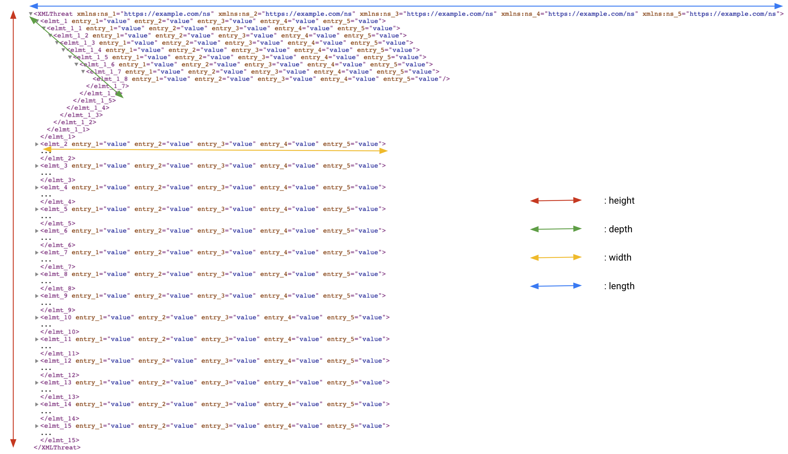
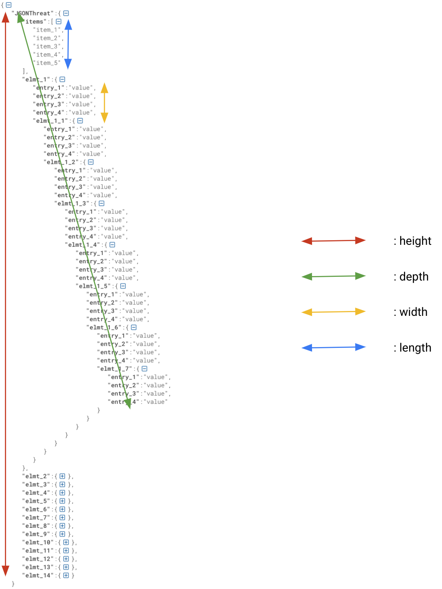

# Threat Protection

As an API management platform, Apigee provides policies that can be used to
detect and reject XML and JSON threats.
The aim of the **threat-protect** API proxy is to help you configure [XML](https://cloud.google.com/apigee/docs/api-platform/reference/policies/xml-threat-protection-policy)
and [JSON](https://cloud.google.com/apigee/docs/api-platform/reference/policies/json-threat-protection-policy)
threat protection policies.
The **threat-protect** API proxy can dynamically generate XML and JSON threats
that are both used as a source to respectively test XML and JSON threat
protection policies.

## Dependencies

- [Maven](https://maven.apache.org/)
- [NodeJS](https://nodejs.org/en/) LTS version or above
- Apigee Evaluation [Organization](https://login.apigee.com/sign__up)

## Quick start

### Apigee X / hybrid

    export APIGEE_X_ORG=xxx
    export APIGEE_X_ENV=xxx
    export APIGEE_X_HOSTNAME=api.example.com

    ./pipeline.sh --googleapi

### Apigee Edge

    export APIGEE_ORG=xxx
    export APIGEE_ENV=xxx
    export APIGEE_USER=xxx
    export APIGEE_PASS=xxx

    ./pipeline.sh --apigeeapi

## Script outputs

The pipeline script deploys on Apigee (Edge, hybrid or X) an API Proxy
containing the full configuration of the threat protection reference.

## What are we testing?

The threat protection reference allows you to test structural limits of XML and
JSON contents.
More specifically, structural dimensions are defined by:

- width
- height
- depth
- length

As said before, XML and JSON threats are created by the API proxy.
Following paragraphs present dimensions for the 2 types of contents, for which
we want to test limits using either an XML or JSON threat protection policy.

### Structural dimensions of an XML document

Here is a picture describing the structural dimensions of an XML document:



- **width** refers to the number of attributes on elements/tags
- **depth** refers to the node depth of an XML document
- **height** refers to the number of child elements of the root element
- **length** refers to the number of namespaces of the root element

### Structural dimensions of a JSON content

Here is a picture describing the structural dimensions of a JSON content:



- **width** refers to the number of entries in an object
- **depth** refers the containment depth, where the containers are objects in
this case
- **height** refers as well the number of entries on the ```JSONThreat```
object (root)
- **length** refers to the number of items in the ```items``` array

## API proxy Endpoints

Available endpoints are the following ones:

1. ```GET /xml```: to generate an XML threat and test the XMLThreatProtection policy
2. ```GET /json```: to generate a JSON threat and test the JSONThreatProtection policy

Once the threat-protect API Proxy has been installed on a target organization
 and deployed into an environment, here are values for these different
 endpoints and method available for each of them:

| Endpoint | Available method + URI |
|:----|:---|
|XML threat test |GET /threats/v1/xml|
|JSON threat test   | GET /threats/v1/json |

### Endpoints details

Here is a detailed description of each endpoints and in particular the
list of required parameters for each of them:

#### XML

| HTTP Method | Base Path |Endpoint URI |
|:----|:----|:----|
| GET |/threats/v1 |/xml |

#### JSON

| HTTP Method | Base Path |Endpoint URI |
|:----|:----|:----|
| GET |/threats/v1 |/json |

#### List of parameters

| Name| Type (query/header/form) | Value | Required (yes/no) |
|:----|:-----:|:----:|:----:|
| width | query | integer | no |
| height | query | integer | no |
| length | query | integer| no |
| depth | query | integer (min. depth = 3)* | no |

(\*): *due to the structure of XML and JSON contents generated*.

### Example for JSON threat protection

    Method:
    GET
    URI:
    /threats/v1/json?width=10&length=20&depth=30&height=17

Output:

Either a fault (status code:400 - message:"Bad Request") or
the JSON content (status code:200) that is generated by the proxy.
**You can modify the configuration of the JSON threat protection
policy to configure this security policy as desired.**

### Example for XML threat protection

    Method:
    GET
    URI:
    /threats/v1/xml?width=10&length=20&depth=30&height=17

Output:

Either a fault (status code:400 - message:"Bad Request") or
the XML content (status code:200) that is generated by the proxy.
**You can modify the configuration of the XML threat protection
policy to configure this security policy as desired.**
