# Introduction

This project aims to showcase Apigee monitoring features by generating distributed traffic across 5 proxies:

* Load-Generator-Users

* Load-Generator-Recommendation

* Load-Generator-Loyalty

* Load-Generator-Checkout

* Load-Generator-Catalog

The architecture looks like this:

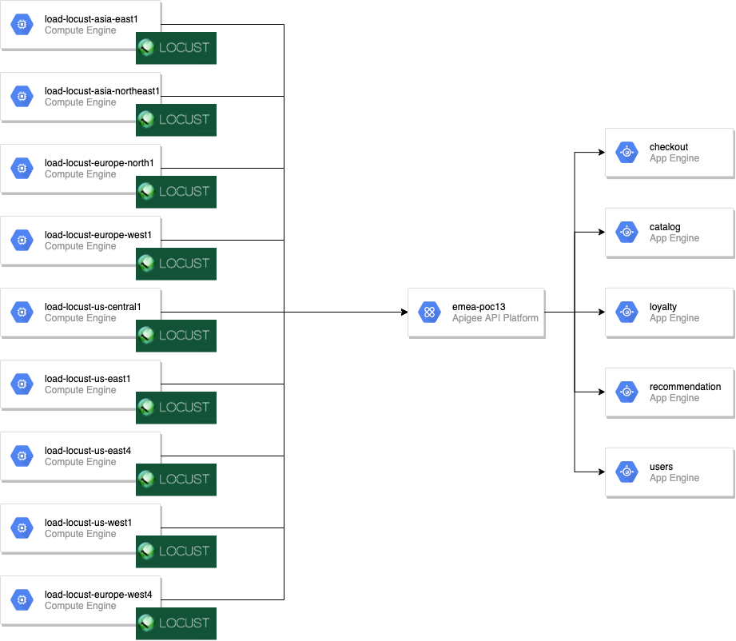

This traffic ensures that there is constant hit on cache, errors and different apps built on top of API Products.

All assets in this project start with Load-Generator except apps.

Demo Product/Proxies relationship 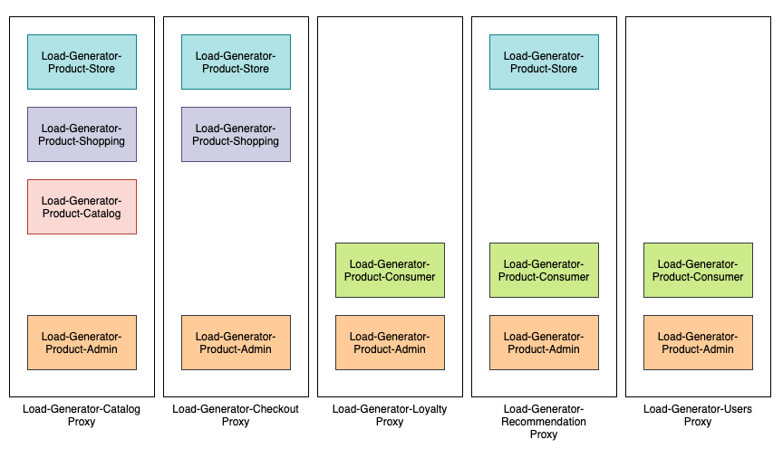

Demo Product/Apps relationship with quotas 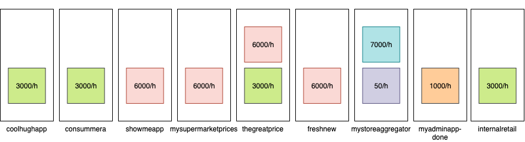

With this demo you should be able to showcase the following use cases:

**API Monitoring**

* Traffic success vs. Errors (all proxies)

* Average response time (enter low rate high peaks) - Introduce latency.

* Traffic by proxy - 5 proxies, different traffic.

* Cache performance - 1 proxy with cache

* 4xx vs, 5xx errors - Introduce client errors vs. backend errors.

* Errors by proxy.

* Target performance - payload size (random)

**API Analytics**

* Device types

* OS

* Agent type

* Browser

* Geo location of API caller

* Latency

* App, API product and developer

* API paths

* * *


# Getting set up

Duration: 45:00

## Requirements

1. A domain name for your backend services. You can use services like [godaddy](https://www.godaddy.com/).

2. A [Google Cloud Project](https://console.cloud.google.com/) with a valid Billing.

3. An [Apigee account ](https://login.apigee.com/)

4. [gcloud sdk](https://cloud.google.com/sdk/install) installed

5. [Docker](https://docs.docker.com/install/) installed

## Install - deploying the demo

1. Clone [this](https://github.com/igalonso/apigee-analytics-load-generator-demo) project in your local folder.

2. Create a [service account](https://cloud.google.com/iam/docs/creating-managing-service-accounts) with GCP onwer role permissions (to be modified in future releases). Generate a [key](https://cloud.google.com/iam/docs/creating-managing-service-account-keys) and save it in the project root folder with the name ```load-generator-key.json```.

3. Run sh init.sh  <ACTION>  <APIGEE_USER> <APIGEE_PASS> <APIGEE_ORG> <APIGEE_ENV> <GPROJECT> <APPENGINE> <APIGEE_URL>  <APPENGINE_DOMAIN_NAME> <UUID>

* **ACTION**: ```launch``` to start the load generator or ```delete``` to remove the load generator

* **APIGEE_USER**: Apigee User with organization administrator permissions

* **APIGEE_PASS**: Apigee password that matches previous user

* **APIGEE_ORG**: Apigee Organization to deploy to.

* **APÎGEE_ENV**: Apigee Environment to use under previous organization.

* **GPROJECT**: Google Cloud Project ID where the VMs will be deployed to.

* **APPENGINE**: Google Cloud App Engine app name that will be used.

* **APIGEE_URL**: Apigee Management URL (for future deployments to Hybrid).

* **APPENGINE_DOMAIN_NAME**: Domain name for your backends.

* **UUID**: Random number that you will need to remember (to support multiple instances of this demo within the same org) in order to delete this deployment afterwards..

4. Wait! It should deploy everything and provide a reliable traffic pattern to your Apigee organization.

5. Update your domain on appengine following [this](https://cloud.google.com/appengine/docs/standard/python/mapping-custom-domains) guide

6. Delete the service account and key to avoid security breaches.

* * *


# Showcase Analytics

Duration: 30:00

* * *


## Debug showcase

* Login into the Apigee console, click on *Develop > API Proxies* and select Load-Generator-Catalog proxy. 

* Go to the *Trace *tab.

* Click on *Start Trace Session*

* Showcase how some API calls are hitting the Quota limit and some others fail because there are errors coming from the backend.

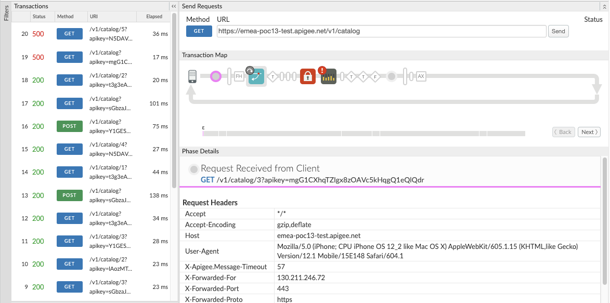

## API Monitoring showcase

This dashboard shows the current status of the platform. Start by going to *Analyze > API Monitoring*

* Overview: Showcase important widgets such as Error rate (around 20%), P99 latency (explain what p99 means) and total traffic.

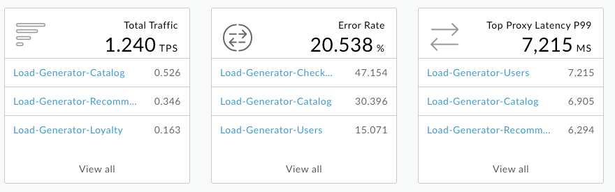

* Click on* Load-Generator-Users*

* Once there, show further details by clicking on the green box named *Load-Generator-Users*.

* Click on Trends and demonstrate that the mean in Total Latency is lower than p99. Explain that this demo has a random latency in the proxies to emulate these peaks.

* Explain why it is important to create Alerts based on p99/p95 to get notified. Then create it easily by clicking on the three dots, *Create Alarm*.

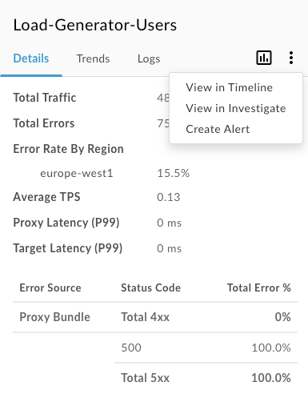

* Configure the Alarm like the following image:

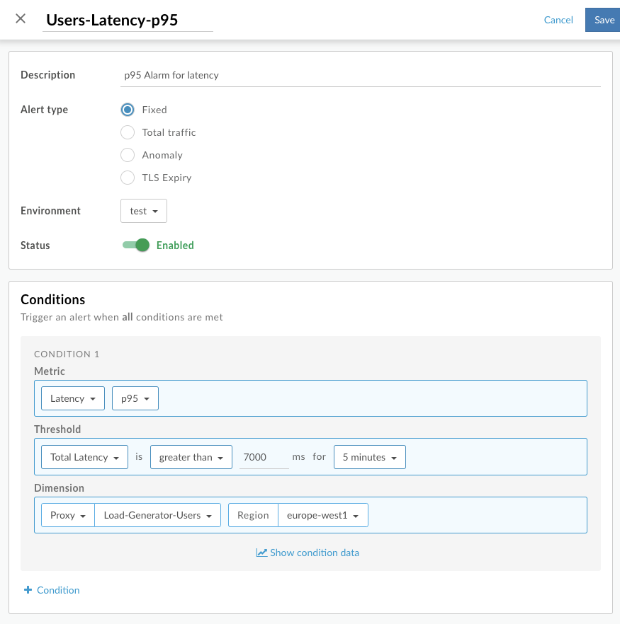

* Finally create an Email Alert Notification. Explain that you can also associate it with webhooks, PagerDuty, Slack…

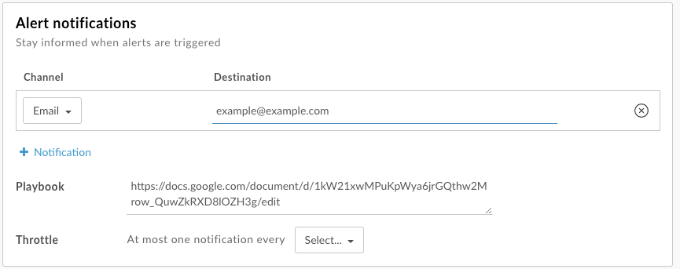

Showcase *Recent* traffic patterns by clicking on *Recent*. Select test as the environment and change the scalar vby from logarithm to linear. We can see that *Load-Generator-Catalog* is the one getting more traffic.

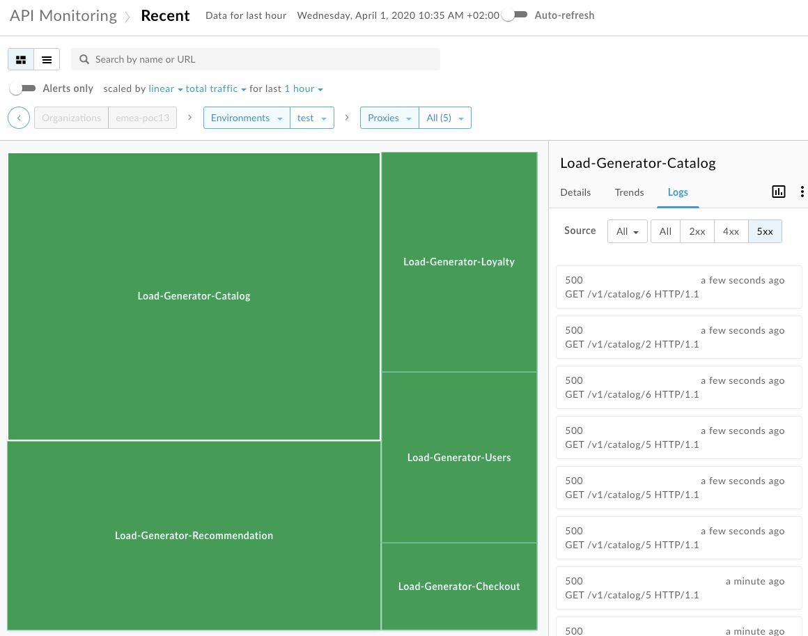

Click on *logs* and then *5xx*. Select any of the errors and show how the information of the request is presented.

## Security Reporting showcase

Go to Runtime to showcase some specifics on *Load-Generator-Catalog*. Showcase that all traffic is *HTTPs* and the top *Developer apps* (mysupermarketprices). 

## API Metrics showcase

This could be done quickly. Just explain the 5 different tabs. 

* **API Proxy Performance**: Demonstrate the different patterns on success/error, Average Response time… You can change the dimensions to select a single proxy and change the dates to last 7 days.

* **Cache Performance: **Explain that, at the moment, the only proxy with cache hit rate is Load-Generator-Catalog as this is the only one that has cache policies. We can see the cache hits and, important, the Cache improvement (3.43 faster, for example).

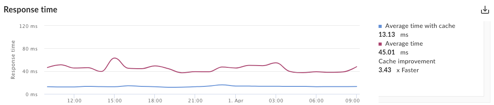

* **Error Code Analysis: **Explain the difference between Proxy errors and target errors. Continue by showcasing the Error by proxy. Explain that the demo has error introduced in Catalog more frequently than the rest or proxies.

* **Latency Analysis: **Again, select one of the Load-Generator proxies and showcase the latency responses.

* **Target Performance: **Target performance is separated by IP. Showcase each of them with the same message above.

## Developers showcase

Use a real customer example for this dashboard: 

*"A customer (we cannot say the name) was very happy with one of their API Products that was driving great revenue to them. However, by looking at this dashboard they realized that 70% of the traffic generated to the API Product was coming from the same app. This was a red flag for them as providers since there was no diversification on their business partners. If this developer team decides to go to another API Product, they would lose 70% of the revenue driven by this product. Based on this information they diversified this API Product to attract new developers and spread a little bit their traffic."*

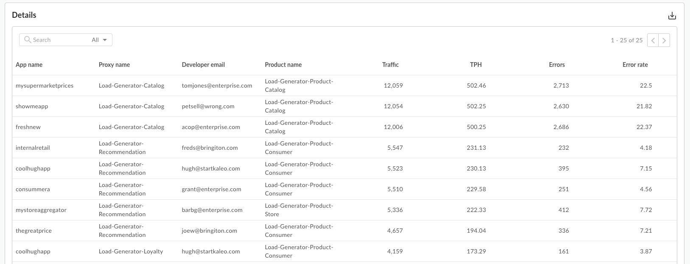

Then focus on one of the apps (for example, supermarketprices). Explain the different metrics (Sum of traffic, sum of error count and Average of total response time). A possible use of this dashboards is identify the type of errors they are getting, find out what could be the problem (mixing it with the debug session) and communicate with the developer to help them with the problem. 

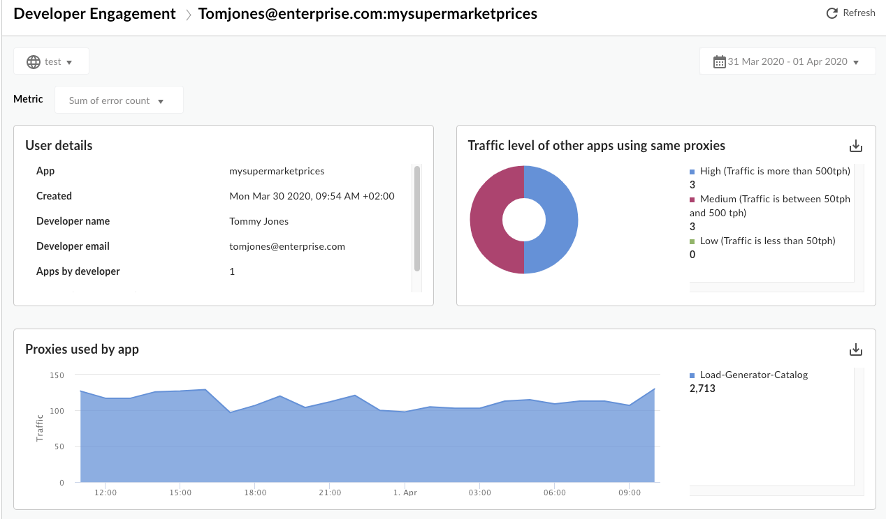

## End Users showcase

*Devices* is an easy dashboard to understand. Go though it quickly and explain that this is just an example of what could be done.

*Geomap* is a tricky one as a Google Cloud doesn’t offer (yet) regional IPs. all the traffic seems to happen from the US while VMs are spread around the globe. Nevertheless, explain this as demo data that vary depending on real traffic patterns.

## Custom Reports

Finally, explain that you can create custom reports and custom report jobs for them use Apigee metrics or even expand with custom metrics using Statistics Collector. 

# Delete demo

Duration: 5:00

Within the project folder (*apigee-analytics-load-generator-demo*), execute the following command:

sh delete-all.sh <APIGEE_USER> <APIGEE_PASS> <APIGEE_ORG> <APIGEE_ENV> <UUID>

Where UUID is the random number generated on the deployment phase (Step 2).

# Todo

Duration: 01:00

Task or action points to improve this demo:

* Delete app engine app - so far, promoting it.

* Fault policy in proxies

* Security - User Activity data.

* Configuration - Activity data.

* Use Locust Distributed

* tag all resources and delete without hardcoding (delete-all.sh)

* tweak product quotas (only mystoreaggregator gives quota errors)

* Change error messages and http codes.

* add oauth to cache tokens and showcase specific cache metrics

* Custom reports

