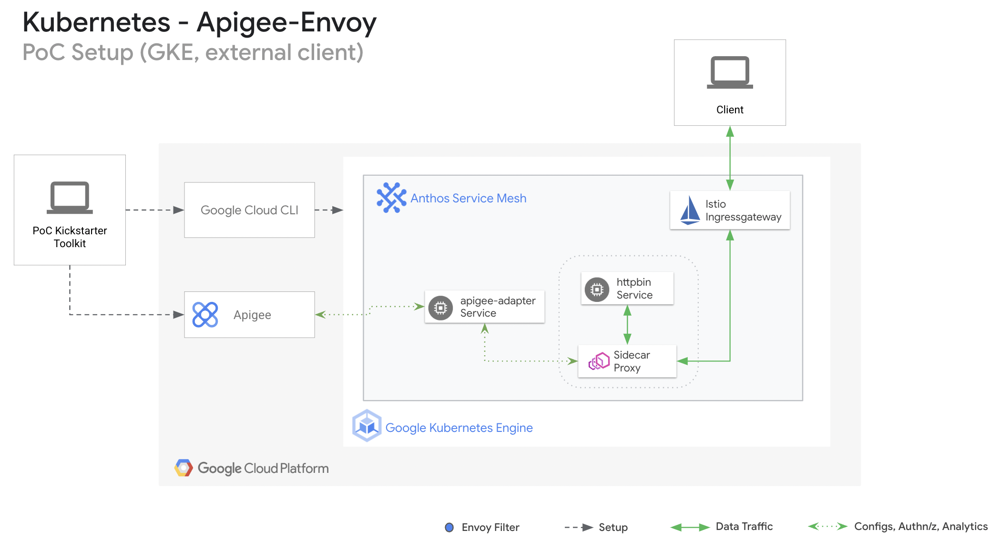

# Apigee Envoy extension (for external access)

This is an extension to the starter setup of apigee-envoy deployment within GKE container platform with Apigee X/Hybrid as API management platform. 

The [starter kit](https://github.com/apigee/devrel/tree/main/tools/apigee-envoy-quickstart#envoy-with-apigee-adapter-as-containers-within-kubernetes-platform) deploys httpbin service configured with Envoy proxies as side car proxies. The Envoy proxy is enabled with apigee-adapter as step in the request path enforcing  Apigee provided authentication methods.

This extension enables the exposure of deployed sample application (httpbin) externally via istio-ingressgateway. It showcases Apigee enabled envoy proxies can offer protection of API traffic intiated outside the mesh. 



## Tools

* kubectl v1.23.0
* bash 5.1.8
* envsubst 0.21

### Pre-requisities:

1. Deployment of [quickstart setup](https://github.com/apigee/devrel/tree/main/tools/apigee-envoy-quickstart#envoy-with-apigee-adapter-as-containers-within-kubernetes-platform) of apigee-envoy adapter within Istio enabled Kubernetes platform. 

1. Ensure Kubernetes cluster is running with istio-ingressgateway and supports external load balancers.(Execute [step 4 and 5](#set-the-namespace-hosting-istio-ingressgateway) below to setup ingressgateway, if missing within the cluster)

### Installation:

1. **Set environment variables.** 
    ```bash
    export USE_GKE_GCLOUD_AUTH_PLUGIN=True
    export GKE_PROJECT_ID=<gcp-project-id-hosting-the-cluster>
    export CLUSTER_NAME=<gke-cluster-name>
    export CLUSTER_LOCATION=<gke-cluster-region>
    export APIGEE_ORG=<apigee-org-tied-to-apigee-envoy-adapter>
    ```

1. **Set up local authentication to your project.**
    ```bash
    gcloud config set project $GKE_PROJECT_ID
    gcloud auth application-default login --no-launch-browser

    export TOKEN=$(gcloud auth print-access-token)
    ```

1. **Set up login profile for your cluster.**
    ```bash
    gcloud container clusters get-credentials "$CLUSTER_NAME" \
     --zone "$CLUSTER_LOCATION" \
     --project "$GKE_PROJECT_ID"
     export CLUSTER_CTX="gke_${GKE_PROJECT_ID}_${CLUSTER_LOCATION}_${CLUSTER_NAME}"
    ```

1. ### Set the namespace hosting istio-ingressgateway
    ```bash
    export $ISTIO_GATEWAY_NS=<namespace-hosting-ingressgateway>
    ```  

1. ### Execute the below if istio-ingressgateway is missing in the istio enabled cluster
    ```bash
    git clone https://github.com/GoogleCloudPlatform/anthos-service-mesh-packages.git \
    /tmp/asm

    kubectl create namespace $ISTIO_GATEWAY_NS

    kubectl label namespace $ISTIO_GATEWAY_NS istio-injection=enabled istio.io/rev-

    kubectl apply -n $ISTIO_GATEWAY_NS \
        -f /tmp/asm/samples/gateways/istio-ingressgateway

    kubectl rollout restart deployment -n $ISTIO_GATEWAY_NS

    kubectl get svc istio-ingressgateway -n $ISTIO_GATEWAY_NS
    ```

1. **Overwrite the service details that has to be exposed outside the mesh, if different from the service (httpbin application) deployed in the [starter kit](https://github.com/apigee/devrel/tree/main/tools/apigee-envoy-quickstart#envoy-with-apigee-adapter-as-containers-within-kubernetes-platform)**
    ```bash
    export TARGET_HOST="httpbin.org"
    export TARGET_SERVICE_NAME="httpbin"
    export TARGET_SERVICE_NAMESPACE="apigee"
    ```

1. **Fetch the Loadbalancer details exposing the ingress gatway**
    ```bash
    export INGRESS_HOST=$(kubectl -n $ISTIO_GATEWAY_NS get service istio-ingressgateway -o jsonpath='{.status.loadBalancer.ingress[0].ip}')
    export INGRESS_PORT=$(kubectl -n $ISTIO_GATEWAY_NS get service istio-ingressgateway -o jsonpath='{.spec.ports[?(@.name=="http2")].port}')
    export SECURE_INGRESS_PORT=$(kubectl -n $ISTIO_GATEWAY_NS get service istio-ingressgateway -o jsonpath='{.spec.ports[?(@.name=="https")].port}')
    export TCP_INGRESS_PORT=$(kubectl -n $ISTIO_GATEWAY_NS get service istio-ingressgateway -o jsonpath='{.spec.ports[?(@.name=="tcp")].port}')
    ```

1. **Setup Gateway component**
    ```bash
   cat <<EOF > /tmp/httpbin-gateway.tmpl              
   apiVersion: networking.istio.io/v1alpha3
   kind: Gateway
   metadata:
     name: httpbin-gateway
   spec:
     selector:
       istio: ingressgateway
     servers:
       - port:
           number: 80
           name: http
           protocol: HTTP
         hosts:
           - "$TARGET_HOST"
   EOF

   envsubst < /tmp/httpbin-gateway.tmpl > /tmp/httpbin-gateway.yaml

   kubectl apply -n $ISTIO_GATEWAY_NS -f /tmp/httpbin-gateway.yaml
    ```

1. **Configure routes for traffic entering via the Gateway:**
    ```bash
   cat <<EOF > /tmp/httpbin-virtual-service.tmpl
   apiVersion: networking.istio.io/v1alpha3
   kind: VirtualService
   metadata:
     name: httpbin-ingress
   spec:
     hosts:
     - "$TARGET_HOST"
     gateways:
     - httpbin-gateway
     http:
     - route:
       - destination:
           host: $TARGET_SERVICE_NAME.$TARGET_SERVICE_NAMESPACE.svc.cluster.local
           port:
             number: 80
   EOF

   envsubst < /tmp/httpbin-virtual-service.tmpl > /tmp/httpbin-virtual-service.yaml
    
   kubectl apply -n $ISTIO_GATEWAY_NS -f /tmp/httpbin-virtual-service.yaml
    ```

1. **Extract the consumer key from the developer app, this is created on Apigee platform during the [quickstart setup](https://github.com/apigee/devrel/tree/main/tools/apigee-envoy-quickstart#envoy-with-apigee-adapter-as-containers-within-kubernetes-platform) :**
    ```bash
    CONSUMER_KEY=$(curl -H "Authorization: Bearer ${TOKEN}"  \
    -H "Content-Type:application/json" \
    "https://apigee.googleapis.com/v1/organizations/${APIGEE_ORG}/developers/test-envoy@google.com/apps/envoy-adapter-app-2" | \
    jq '.credentials[0].consumerKey'); \
    CONSUMER_KEY=$(echo "$CONSUMER_KEY"|cut -d '"' -f 2); 
    ```

1. **Extract IP address exposed via ingressgateway component**
    ```bash
    EXTERNAL_IP=$(kubectl --context="${CLUSTER_CTX}" get svc -n "$ISTIO_GATEWAY_NS" -o json | \
    jq '.items[0].status.loadBalancer.ingress[0].ip' | \
    cut -d '"' -f 2)
    ```

1. **Testing protected service via external IP...**
    ```bash
    curl -i http://"$EXTERNAL_IP"/headers -H "x-api-key: $CONSUMER_KEY" \
    -H "Host: $TARGET_HOST"
    ```
