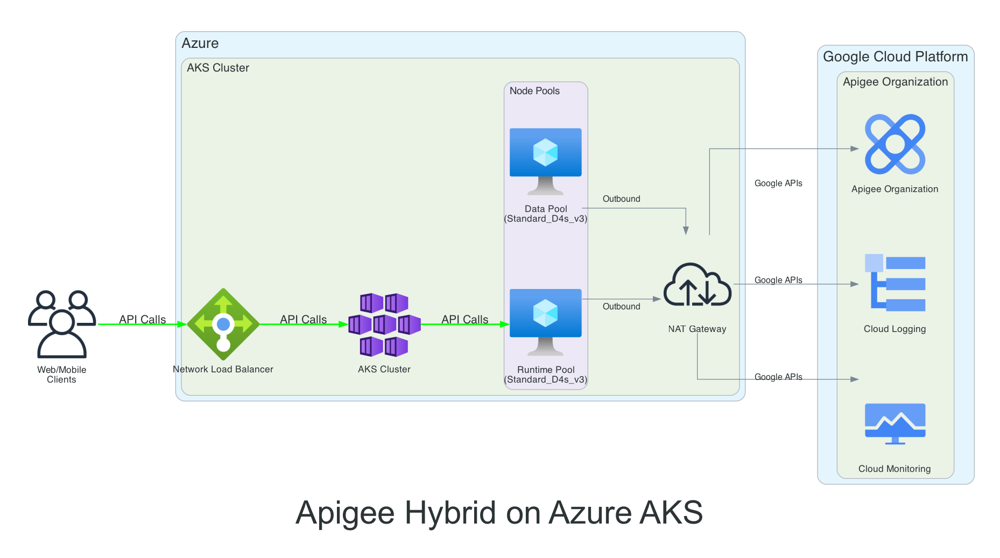
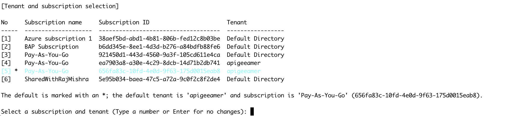

## Disclaimer
This tool is open-source software. It is not an officially supported Google product. It is not a part of Apigee, or any other officially supported Google Product.

## Architecture

The following diagram illustrates the architecture of Apigee Hybrid on Azure AKS:



The architecture consists of:

1. **Client Layer**:
   - Web/Mobile clients making API calls to the AKS cluster

2. **Azure Infrastructure**:
   - Network Load Balancer for distributing incoming traffic
   - AKS Cluster with:
     - Runtime Pool for Apigee runtime components
     - Data Pool for Apigee data components
   - NAT Gateway for outbound connectivity

3. **Google Cloud Platform**:
   - Apigee Organization for API management
   - Cloud Logging for log collection
   - Cloud Monitoring for metrics and observability


## How to Setup Apigee hybrid on Azure AKS Clusters using Terraform

The Terraform configuration defines a new Virtual Network (VNet) in which to provision the Azure Kubernetes Service (AKS) cluster. It uses the `azurerm` provider to create the required Azure resources, including the AKS cluster, node pools (with auto-scaling capabilities), Network Security Groups (NSGs), and necessary Azure RBAC configurations (e.g., using Managed Identities or Service Principals).

Open the `main.tf` file to review the resource configuration. The `azurerm_kubernetes_cluster` resource configures the cluster, including a default system node pool. Additional user node pools can be defined using `azurerm_kubernetes_cluster_node_pool` resources, for example, to have different VM sizes or capabilities for specific workloads (like Apigee runtime components).

Once the terraform provisions the aks infrastructure, it proceeds to create Apigee Organization, Environment and Environment Group and installs Apigee Hybrid.


## Getting Started

1.  **Setup an Azure Account/Subscription** if you don't have one. You can start with a free account [here](https://azure.microsoft.com/en-us/free/).
2.  **Create an Azure Service Principal or use your User Account**:
    *   For automation and CI/CD, it's recommended to create a Service Principal with the necessary permissions (e.g., "Contributor" on the subscription or a specific resource group). Follow instructions [here](https://learn.microsoft.com/en-us/azure/developer/terraform/authenticate-to-azure?tabs=bash#create-a-service-principal).
    *   Alternatively, you can authenticate as a user via Azure CLI.
    
3.  **Download and install Terraform** to your local terminal as described [here](https://developer.hashicorp.com/terraform/install).
4.  **Download and install the Azure CLI (az)** to your local terminal from where Terraform would be run, as described [here](https://learn.microsoft.com/en-us/cli/azure/install-azure-cli).
5.  **Download and install Helm** (version 3.15+ recommended, check Apigee docs for specific version compatibility).
6. **Install Google Cloud SDK**:
   ```bash
   # Check if gcloud is installed
   gcloud version

   # If not installed, follow instructions at:
   # https://cloud.google.com/sdk/docs/install
   # Ensure you have the latest version
   ```
7.  **Install kubectl**:
    ```bash
    # Check if kubectl is installed
    kubectl version --client
    
    # If not installed, follow instructions at:
    # https://kubernetes.io/docs/tasks/tools/install-kubectl/
    # Ensure version 1.29 or higher
    ```
8.  Run `terraform init` to initialize Terraform and download necessary providers.

## Setup Steps

1.  **Authenticate with Azure**:
    *   **Interactive Login (User Account)**: Run `az login`. This command will open a browser for authentication. The Azure CLI will then store your credentials locally.
    
    *   **Service Principal**: If you created a Service Principal, ensure your environment variables are set for Terraform to authenticate, or configure them in the Azure provider block:
        ```bash
        export ARM_CLIENT_ID="your-sp-app-id"
        export ARM_CLIENT_SECRET="your-sp-password"
        export ARM_SUBSCRIPTION_ID="your-subscription-id"
        export ARM_TENANT_ID="your-tenant-id"
        ```
2. **Configure Google Cloud Authentication**:
   There are two ways to authenticate with Google Cloud:

   a) **User Account Authentication**:
   * Ensure you have the Google Cloud SDK (gcloud) installed and configured
   * Run `gcloud auth application-default login` to authenticate
   * Set your project: `gcloud config set project <your-project-id>`

   b) **Service Account Authentication**:
   * Create a service account with appropriate permissions (Owner/Editor)
   * Download the service account key JSON file
   * Set the environment variable: `export GOOGLE_APPLICATION_CREDENTIALS="path/to/your/service-account-key.json"`
   * Run `gcloud auth activate-service-account --key-file="path/to/your/service-account-key.json"`
   * Set your project: `gcloud config set project <your-project-id>`
   * Alternatively, you can specify the credentials file path in your Terraform provider configuration:
     ```hcl
     provider "google" {
       credentials = file("path/to/your/service-account-key.json")
       project     = "<your-project-id>"
     }
     ```

   Note: 
   * Ensure that Organization Policy is not disabled to create service account and associated Service Account Key
   * Ensure that the user or service account performing terraform has the permissions to access Google Cloud resources. While not recommended but roles like `roles/editor` or `roles/owner` should ensure all tasks completes successfully


3.  **Customize the Terraform configuration files**:
    *   Review `main.tf` (and any module files) to adjust Azure resource definitions like VNet address spaces, AKS cluster version, node pool configurations (VM sizes, count, taints, labels for Apigee workloads).
    *   Update `terraform.tfvars` file (or create one, e.g., `terraform.tfvars`) with your specific values (e.g., Azure region and Apigee Organization etc).

#### **terraform.tfvars Variable Reference**

**Descriptions for each variable** listed below the table for more detail.

| Variable | Description | Example/Default |
|----------|-------------|----------------|
| `azure_location` | Azure region for resources | `"eastus"` |
| `gcp_project_id` | GCP Project ID for Apigee | `"apigee-aks-example1"` |
| `gcp_region` | GCP region for Apigee resources | `"us-central1"` |
| `apigee_org_name` | Apigee organization name (usually same as GCP project) | `"apigee-aks-example1"` |
| `apigee_org_display_name` | Display name for Apigee org | `"Apigee on AKS Example"` |
| `apigee_env_name` | Apigee environment name | `"dev"` |
| `apigee_envgroup_name` | Apigee environment group name | `"dev-group"` |
| `apigee_namespace` | Kubernetes namespace for Apigee | `"apigee"` |
| `apigee_version` | Apigee Hybrid version | `"1.14.2-hotfix.1"` |
| `apigee_cassandra_replica_count` | Cassandra replica count | `1` |
| `hostnames` | List of hostnames for Apigee env group | `["api.example.com", "api-dev.example.com"]` |
| `tls_apigee_self_signed` | Use self-signed TLS certs (`true`/`false`) | `true` |
| `tls_apigee_cert_path` | Path to TLS cert (if not self-signed) | `"path/to/your/tls.crt"` |
| `tls_apigee_key_path` | Path to TLS key (if not self-signed) | `"path/to/your/tls.key"` |
| `apigee_lb_ip` | (Optional) Static IP for LB | `"4.156.46.192"` |
| `create_org` | Create Apigee org (`true`/`false`) | `true` |
| `apigee_install` | Install Apigee Hybrid (`true`/`false`) | `true` |
| `ingress_name` | Name for ingress resource | `"apigee-ing"` |
| `ingress_svc_annotations` | Service annotations for LB (cloud-specific) | `{}` |


4.  **Run `terraform plan`**:
    Validate the list of Azure resources to be created. The exact count will vary based on your configuration. Review the plan carefully to ensure it matches your expectations.

5.  **Run `terraform apply`**:
    This will provision the Azure resources and create the AKS cluster. Confirm the apply when prompted. This process can take several minutes.

## What Happens During Terraform Apply

When you run `terraform apply`, the following resources are created in sequence:

1. **Azure Infrastructure Setup**:
   - Creates a new Resource Group with a random suffix
   - Sets up a Virtual Network (VNet) with address space 10.0.0.0/16
   - Creates a subnet for AKS nodes (10.0.1.0/24)
   - Provisions a NAT Gateway with a public IP for outbound connectivity
   - Associates the NAT Gateway with the AKS subnet

2. **AKS Cluster Creation**:
   - Creates the main AKS cluster with a system node pool
   - Configures network plugin and policy as "azure"
   - Sets up service CIDR (10.1.0.0/16) and DNS service IP (10.1.0.10)
   - Enables system-assigned managed identity

3. **Additional Node Pools**:
   - Creates "apigeerun" node pool for Apigee runtime components
   - Creates "apigeedata" node pool for Apigee data components
   - Both pools support auto-scaling if enabled
   - Configures appropriate VM sizes and disk sizes for each workload

4. **GCP/Apigee Setup** (if `create_org=true`):
   - Enables required Google Cloud APIs (Apigee, IAM, Compute, etc.)
   - Creates an Apigee organization in your GCP project
   - Sets up an Apigee environment (e.g., "dev")
   - Creates an environment group with specified hostnames
   - Attaches the environment to the environment group

5. **Service Account and Certificate Setup**:
   - Creates a GCP service account for Apigee Hybrid
   - Generates a service account key
   - Creates self-signed TLS certificates for the environment group hostnames
   - Saves all credentials and certificates to the `output/<project-id>` directory

6. **Apigee Hybrid Installation** (if `apigee_install=true`):
   - Creates the Apigee namespace in the EKS cluster
   - Enables control plane access for the service account
   - Installs required Kubernetes components:
     - Custom Resource Definitions (CRDs)
     - cert-manager
     - Apigee operator
     - Deploys Apigee components in sequence:
     - Datastore (Cassandra)
     - Telemetry
     - Redis
     - Ingress Manager
     - Organization
     - Environment
     - Environment Group
   - Sets up the ingress gateway with the specified configuration


The entire process typically takes 15-30 minutes to complete, depending on the size of your cluster and the number of resources being created.


## Accessing the Cluster

Terraform generates kubeconfig specific to the output directory and it can be found at output/<project-id>/apiigee-kubeconfig.

To access the cluster, configure your `kubectl` to use the generated kubeconfig file:
```bash
export KUBECONFIG=output/<project-id>/apigee-kubeconfig
```

```bash
kubectl get pods -A
```


## Accessing Apigee Endpoint

* Get the ingress IP/DNS to access Apigee
```bash
kubectl get pods -n apigee
kubectl get svc dev-group -n apigee -o jsonpath='{.status.loadBalancer.ingress[0].ip}'
```
* Add the ingress IP/DNS to Apigee Environment Group Hostnames through Apigee UI

* Access the healthz endpoint
```bash
curl -H 'User-Agent: GoogleHC' https://api.example.com/healthz/ingress -k \
  --resolve "api.example.com:443:your-ingress-ip>"
```

## Cleanup

When you're done with the Apigee hybrid setup and want to remove all created resources, follow these steps:

1. **Remove Apigee Hybrid Components**:
   ```bash
   # Delete Apigee hybrid components from the cluster
   helm uninstall <<apigee-hybrid-components>> -n apigee
   ```

2. **Destroy Terraform Resources**:
   ```bash
   # Remove all Azure resources created by Terraform
   terraform destroy
   ```
   This will remove:
   - The AKS cluster and all node pools
   - Virtual Network and subnets
   - NAT Gateway and associated resources
   - Resource Group
   - All other Azure resources created by the Terraform configuration
   - Apigee Organization, Environment and Environment Group

3. **Clean Up Local Files**:
   ```bash
   # Remove generated certificates and keys
   rm -rf output/${PROJECT_ID}/
   
   # Remove Terraform state files
   rm -f terraform.tfstate*
   ```

4. **Optional: Remove GCP Resources**:
   
   Terraform destroy should clean this up but in case of failure, you can 
   delete the GCP resources individually

   If you created GCP resources (like Apigee organization, environment, etc.), you may want to remove them as well:
   ```bash
   # Delete Apigee environment group
   gcloud apigee envgroups delete ${ENVGROUP_NAME} --organization=${PROJECT_ID}
   
   # Delete Apigee environment
   gcloud apigee environments delete ${ENV_NAME} --organization=${PROJECT_ID}
   
   # Delete Apigee organization (if created)
   gcloud apigee organizations delete ${PROJECT_ID}
   ```

Note: The `terraform destroy` command will prompt for confirmation before proceeding. Make sure you have backups of any important data before running the cleanup commands.


