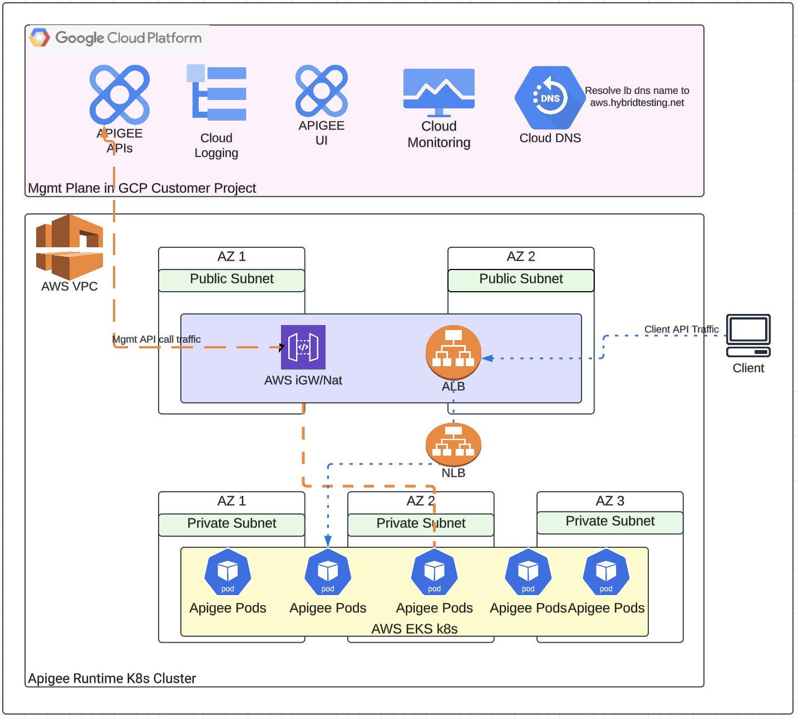
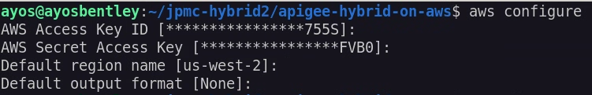

## Disclaimer
This tool is open-source software. It is not an officially supported Google product. It is not a part of Apigee, or any other officially supported Google Product.

## How to Setup Apigee hybrid on AWS EKS Clusters using Terraform 

The terraform configuration defines a new VPC in which to provision the cluster, and uses the public EKS module to create the required resources, including Auto Scaling Groups, security groups, and IAM Roles and Policies.
Open the main.tf file to review the module configuration. The eks_managed_node_groups parameter configures the cluster with three nodes across two node groups.  

### Architecture

The following diagram illustrates the architecture of Apigee Hybrid on Azure AKS:




## Getting Started

1. **Setup an AWS Account** if you dont have one as described [here](https://aws.amazon.com/free/?gclid=Cj0KCQiA4fi7BhC5ARIsAEV1YibM5aQfcEpKMPjPwUGl-JqNl6fp9-LoTxpHhH2RFh59MFc1_yETcCQaAmHGEALw_wcB&trk=c8882cbf-4c23-4e67-b098-09697e14ffd9&sc_channel=ps&ef_id=Cj0KCQiA4fi7BhC5ARIsAEV1YibM5aQfcEpKMPjPwUGl-JqNl6fp9-LoTxpHhH2RFh59MFc1_yETcCQaAmHGEALw_wcB:G:s&s_kwcid=AL!4422!3!453053794281!e!!g!!create%20aws%20account!10706954804!104359293503&all-free-tier.sort-by=item.additionalFields.SortRank&all-free-tier.sort-order=asc&awsf.Free%20Tier%20Types=*all&awsf.Free%20Tier%20Categories=*all)  

2. **Create an IAM user and a cli user** As described [here](https://docs.aws.amazon.com/IAM/latest/UserGuide/id_users_create.html) ( we would use the cli user credentials when configuring our aws cli)  

3.  **Download and install Terraform** to your local terminal as described [here](https://developer.hashicorp.com/terraform/install).
4.  **Download and install the EKS CLI (aws)**:
    ```bash
    # Check if aws CLI is installed
    aws --version

    # If not installed, follow instructions at:
    # https://docs.aws.amazon.com/cli/latest/userguide/getting-started-install.html
    # Ensure you have the latest version
    ```
5.  **Download and install Helm** (version 3.15+ recommended, check Apigee docs for specific version compatibility).
6. **Install Google Cloud SDK**:
   ```bash
   # Check if gcloud is installed
   gcloud version

   # If not installed, follow instructions at:
   # https://cloud.google.com/sdk/docs/install
   # Ensure you have the latest version
   ```
7.  **Install kubectl**:
    ```bash
    # Check if kubectl is installed
    kubectl version --client
    
    # If not installed, follow instructions at:
    # https://kubernetes.io/docs/tasks/tools/install-kubectl/
    # Ensure version 1.29 or higher
    ```
8.  Run `terraform init` to initialize Terraform and download necessary providers.


## Pre-Cluster Setup Steps  
 
1. Run aws configure - Run aws configure command to configure settings that the AWS Command Line Interface (AWS CLI) uses to interact with AWS. The credentials and config file are created/updated when you run the command aws configure. The credentials file is located at ~/.aws/credentials on Linux or macOS,  or at C:\Users\USERNAME\.aws\credentials on Windows.  
   Output should be similar to below  
   
   
2. **Configure Google Cloud Authentication**:
   There are two ways to authenticate with Google Cloud:

   a) **User Account Authentication**:
   * Ensure you have the Google Cloud SDK (gcloud) installed and configured
   * Run `gcloud auth application-default login` to authenticate
   * Set your project: `gcloud config set project <your-project-id>`

   b) **Service Account Authentication**:
   * Create a service account with appropriate permissions (Owner/Editor)
   * Download the service account key JSON file
   * Set the environment variable: `export GOOGLE_APPLICATION_CREDENTIALS="path/to/your/service-account-key.json"`
   * Run `gcloud auth activate-service-account --key-file="path/to/your/service-account-key.json"`
   * Set your project: `gcloud config set project <your-project-id>`
   * Alternatively, you can specify the credentials file path in your Terraform provider configuration:
     ```hcl
     provider "google" {
       credentials = file("path/to/your/service-account-key.json")
       project     = "<your-project-id>"
     }
     ```

   Note: 
   * Ensure that Organization Policy is not disabled to create service account and associated Service Account Key
   * Ensure that the user or service account performing terraform has the permissions to access Google Cloud resources. While not recommended but roles like `roles/editor` or `roles/owner` should ensure all tasks completes successfully


3.  **Customize the Terraform configuration files**:
    
    Review and update the `terraform.tfvars` file with your specific values. Below is a table of all supported variables, their descriptions, and example/default values:

    | Variable Name                  | Description                                                                 | Example/Default Value                |
    |--------------------------------|-----------------------------------------------------------------------------|--------------------------------------|
    | eks_region                     | AWS region for EKS cluster                                                  | "us-west-1"                         |
    | project_id                     | The GCP project ID                                                          | "apigee-eks-example2"               |
    | region                         | The GCP region for resources                                                | "us-west1"                          |
    | apigee_org_name                | The name of the Apigee organization                                         | "apigee-eks-example2"               |
    | apigee_env_name                | The name of the Apigee environment                                          | "dev"                               |
    | apigee_envgroup_name           | The name of the Apigee environment group                                    | "dev-group"                         |
    | cluster_name                   | Name of the EKS cluster                                                     | "apigee-eks"                        |
    | apigee_namespace               | Kubernetes namespace for Apigee components                                  | "apigee"                            |
    | apigee_version                 | Apigee Hybrid version                                                       | "1.14.2-hotfix.1"                   |
    | apigee_org_display_name        | Display name for the Apigee organization                                    | "My Company Apigee Organization"    |
    | apigee_env_display_name        | Display name for the Apigee environment                                     | "Development Environment"           |
    | apigee_instance_name           | Name of the Apigee instance                                                 | "apigee-instance"                   |
    | apigee_cassandra_replica_count | Number of Cassandra replicas (recommended: 3 for production)                | 1                                    |
    | hostnames                      | List of hostnames for the Apigee environment group                          | ["api.mycompany.com", "api-dev.mycompany.com"] |
    | tls_apigee_self_signed         | Use self-signed certificates for Apigee TLS (true/false)                    | true                                 |
    | tls_apigee_cert_path           | Path to your TLS certificate (if not self-signed)                           | "path/to/your/tls.crt"              |
    | tls_apigee_key_path            | Path to your TLS private key (if not self-signed)                           | "path/to/your/tls.key"              |
    | apigee_lb_ip                   | IP address for the Apigee Load Balancer (optional, usually auto-assigned)   | ""                                   |
    | create_org                     | Whether to create a new Apigee organization (true/false)                    | true                                 |
    | apigee_install                 | Whether to install Apigee components (true/false)                           | true                                 |
    | ingress_name                   | Name of the ingress                                                         | "apigee-ingress"                    |
    | ingress_svc_annotations        | Annotations for the ingress service (map)                                   | { ... }                              |
    | overrides_template_path        | Path to the overrides template file (optional)                              | "../apigee-hybrid-core/overrides-templates.yaml" |
    | service_template_path          | Path to the service template file (optional)                                | "../apigee-hybrid-core/apigee-service-template.yaml" |
    | billing_type                   | The billing type for the Apigee organization                                | "EVALUATION" or "PAID"             |

    > **Tip:** You can copy `terraform.tfvars.sample` to `terraform.tfvars` and edit it with your values.

    Example:
    ```hcl
    project_id = "apigee-eks-example2"
    region     = "us-west1"
    apigee_org_name = "apigee-eks-example2"
    # ...
    ```

4.  **Run `terraform plan`**:
    Validate the list of Azure resources to be created. The exact count will vary based on your configuration. Review the plan carefully to ensure it matches your expectations.
      

5.  **Run `terraform apply`**:
    This will provision the AWS resources and create the EKS cluster. Confirm the apply when prompted. This process can take several minutes.

## What Happens During Apply

When you run `terraform apply`, the following sequence of events occurs:

1. **AWS Infrastructure Setup**:
   - Creates a new VPC with public and private subnets across two availability zones
   - Sets up NAT Gateway for private subnet internet access
   - Configures security groups and IAM roles
   - Creates an EKS cluster with managed node groups:
     - `apigee-runtime` node group with 2 t3.xlarge instances
     - `apigee-data` node group with 1 t3.xlarge instance
   - Installs the AWS EBS CSI driver for persistent storage

2. **GCP/Apigee Setup** (if `create_org=true`):
   - Enables required Google Cloud APIs (Apigee, IAM, Compute, etc.)
   - Creates an Apigee organization in your GCP project
   - Sets up an Apigee environment (e.g., "dev")
   - Creates an environment group with specified hostnames
   - Attaches the environment to the environment group

3. **Service Account and Certificate Setup**:
   - Creates a GCP service account for Apigee Hybrid
   - Generates a service account key
   - Creates self-signed TLS certificates for the environment group hostnames
   - Saves all credentials and certificates to the `output/<project-id>` directory

4. **Apigee Hybrid Installation** (if `apigee_install=true`):
   - Creates the Apigee namespace in the EKS cluster
   - Enables control plane access for the service account
   - Installs required Kubernetes components:
     - Custom Resource Definitions (CRDs)
     - cert-manager
     - Apigee operator
     - Deploys Apigee components in sequence:
     - Datastore (Cassandra)
     - Telemetry
     - Redis
     - Ingress Manager
     - Organization
     - Environment
     - Environment Group
   - Sets up the ingress gateway with the specified configuration

The entire process typically takes 15-30 minutes to complete, depending on your network speed and the size of the cluster.

## Accessing the Cluster

Terraform generates kubeconfig specific to the output directory and it can be found at output/<project-id>/apiigee-kubeconfig.

To access the cluster, configure your `kubectl` to use the generated kubeconfig file:
```bash
export KUBECONFIG=output/<project-id>/apigee-kubeconfig
```

```bash
kubectl get pods -A
```


## Accessing Apigee Endpoint

* Get the ingress IP/DNS to access Apigee
```bash
kubectl get pods -n apigee
kubectl get svc dev-group -n apigee -o jsonpath='{.status.loadBalancer.ingress[0].ip}'
```
* Add the ingress IP/DNS to Apigee Environment Group Hostnames through Apigee UI

* Access the healthz endpoint
```bash
curl -H 'User-Agent: GoogleHC' https://my-eks-alb-123456.us-west-2.elb.amazonaws.com/healthz/ingress -k
```

## Multiple clusters  

To create multiple clusters perform the following steps  

Clone the repo to another folder (or copy existing and delete terraform state files and folder)

Now repeat from steps 3 above  


## Clean Up  

To perform a clean up of the aws resources created by terraform

Step 1. Delete the aws loadbalancers created ( these get created when the ingress is created and also another one when the kubernetes service in part 3 is created). Alternative to this step would be to import the loadbalancers created manually with terraform import so terraform can manage the destruction of these going forward.  

Step 2. Run terraform destroy to delete the aws resources created by terraform  
