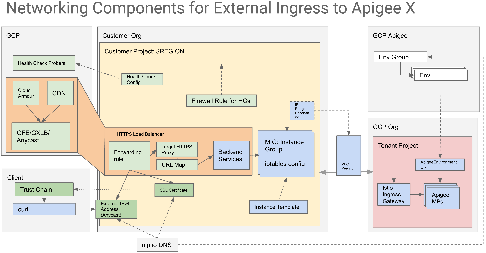
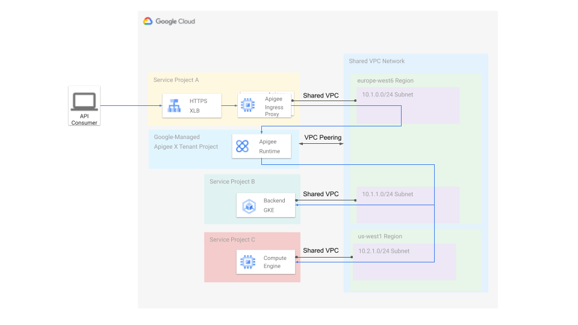

# Apigee X Trial Provisioning

## Description

This script creates an Apigee X evaluation organization and instance. It uses
`gcloud` commands to create an Apigee runtime instance,
a proxy [MIG](https://cloud.google.com/compute/docs/instance-groups) and a
[GCLB](https://cloud.google.com/load-balancing/docs) for external exposure.



The script follows the [documentation installation steps](https://cloud.google.com/apigee/docs/api-platform/get-started/install-cli#external).
The relevant step numbers are added for easier cross-referencing.

If you provisioned an organization using the [Apigee eval provisioning wizard](https://cloud.google.com/apigee/docs/api-platform/get-started/eval-orgs#wiz),
you can run this script to add the proxy MIG and GCLB configuration for
external exposure.

A reference example of [Command Line](https://cloud.google.com/apigee/docs/api-platform/get-started/install-cli)
Provisioning for Apigee X.

Please refer to the documentation for the latest usage.

## Usage

**Note:** To customize your installation with optional configuration parameters
see below.

### Run locally

You need to set up a `PROJECT` environment variable.

```sh
export PROJECT=<gcp-project-name>
```

Then you can run the script. You can use the `--quiet` option to skip the manual
confirmation step.

```sh
 ./apigee-x-trial-provision.sh
```

### Run locally with script on Github

To invoke the script directly from the github repo, use

<!-- markdownlint-disable MD013 -->
```sh
curl -L https://raw.githubusercontent.com/apigee/devrel/main/tools/apigee-x-trial-provision/apigee-x-trial-provision.sh | bash -
```
<!-- markdownlint-enable MD013 -->

WARNING: A successful `Provisioning organization...` step takes 25-30 minutes
to complete. According to the documentation: "This is a long running operation
and could take anywhere from 10 minutes to 1 hour to complete." [->](https://cloud.google.com/sdk/gcloud/reference/alpha/apigee/organizations/provision)

After the script runs, it displays your `RUNTIME_IP`, `RUNTIME_TLS_CERT`
location, your `RUNTIME_HOST_ALIAS`, and an example `curl` command to send a test
request to an automatically deployed hello-world proxy.

When the script finishes, it takes an extra 5-7 minutes to provision
the load balancing infrastructure. You can use the example `curl` command
to run it until 200 OK is returned to ensure that Apigee X install
is fully completed.

Sample Output (using the self-signed certificate option, see below):

```sh
export RUNTIME_IP=203.0.113.10

export RUNTIME_TLS_CERT=~/mig-cert.pem
export RUNTIME_HOST_ALIAS="$PROJECT-eval.apigee.net"

curl --cacert "$RUNTIME_TLS_CERT" "https://$RUNTIME_HOST_ALIAS/hello-world" -v \
  --resolve "$RUNTIME_HOST_ALIAS:443:$RUNTIME_IP"
```

A self-signed key and certificate are generated for your convenience. You can
use your own certificate and key if you override `$RUNTIME_TLS_CERT` and
`$RUNTIME_TLS_KEY` environment variables.

The curl command above uses `--resolve` for ip address resolution
and `--cacert` for trusting the certificate.

To be able to execute requests transparantly at your development machine,
you need:

1. Add the `RUNTIME_TLS_CERT` certificate your machine truststore;
2. Add the `RUNTIME_IP` with the `RUNTIME_HOST_ALIAS` to
your machine's `/etc/hosts` file.

## Optional Customization

The following arguments can all be overridden (otherwise the indicated defaults
are used):

### Networking

You can override the network and subnetwork used to peer your Apigee X organization:

```sh
export NETWORK=default
export SUBNET=default

export PROXY_MACHINE_TYPE=e2-micro
export PROXY_PREEMPTIBLE=false
export PROXY_MIG_MIN_SIZE=1
```

### Regions and Zones

You can override the following locations:

```sh
# Used for regional resources like routers and subnets
export REGION=europe-west1
# Used as the Apigee X runtime location (trial orgs are zonal only)
export ZONE=europe-west1-b
# Used as the Apigee alalytics region (see docs for allowed values)
export AX_REGION=europe-west1
```

### Certificates and Hostname

The following certificate options are supported and can be configured through
the `CERTIFICATES` environment variable:

<!-- markdownlint-disable MD013 -->
|`CERTIFICATES` value|Description|Hostname|
|---|---|---|
|`managed` (default)|Google-managed Certificates|\[external ip\].nip.io (use nip.io for test purposes only)|
|`generated`|Auto-Generated Self-Signed Certs|$RUNTIME_HOST_ALIAS or else $ORG-eval.apigee.net|
|`supplied`|User-supplied in `RUNTIME_TLS_CERT` and `RUNTIME_TLS_KEY`|$RUNTIME_HOST_ALIAS or else $ORG-eval.apigee.net|
<!-- markdownlint-enable MD013 -->

## Apigee X instance with Custom Networking Provisioning
<!-- markdownlint-disable MD013 -->

### VPC Network Planning

When working with custom networks, the first step we do is to plan a layout of your your network with regards to CIDR allocations. It is important because as a rule, allocated CIDR ranges should not overlap between VPCs and Kubernetes clusters. In oour case, there are three decisions to make:

| Custom Network | exco-vpc |
|---|---|
| Network CIDR | 10.0.0.0/14 For routes and firewall rules, etc |
|Subnet | exco-vpc-dev-subnet |
| Subnet Primary Range | CIDR: 10.0.0.0/16 CIDR IP Range: 10.0.0.0 - 10.0.255.255, 65,536 IP addresses |
| Apigee X Peering Range | /23 -- a default peering range for [Apigee X Trial installation](https://cloud.google.com/apigee/docs/api-platform/get-started/install-cli-eval) |

For details on peering range, see: [Understanding of Peering Ranges](https://cloud.google.com/apigee/docs/api-platform/system-administration/peering-ranges)

For extended advise on the topic, including GCP recommended naming convention, see: <https://cloud.google.com/solutions/best-practices-vpc-design>

### Bastion VM in a default network

This is an optional section. You can skip it if you know what you are doing. If it is your first time in GCP, follow these instructions.

As Apigee X instance provisioning is a long-running operation, it is recommended to use your working PC terminal or to provision a bastion VM. Bastion VM is also useful for troubleshooting, at it would be able to access private network addresses.

We are following Best Security Practices here to use a Bastion host and a Service Account to execute gcloud commands and not to expose operator credentials. For Details, see <https://cloud.google.com/compute/docs/access/create-enable-service-accounts-for-instances#best_practices>.

We are going to:

* create a Service Account;
* add Editor and Network Admin roles to it;
* provision a VM with scope and service account that will allow execute the provisioning script successfully;
* invoke SSH session at the VM.

1. In the GCP Console, activate Cloud Shell

1. Define PROJECT variable

```sh
export PROJECT=<your-project-id>
```

1. Create a service account for installation purposes.

Click at the Authorize button when asked.

```sh
export INSTALLER_SA_ID=installer-sa

gcloud iam service-accounts create $INSTALLER_SA_ID
```

1. Add IAM policy bindings with required roles

```sh
roles='roles/editor roles/compute.networkAdmin'

for r in $roles; do
    gcloud projects add-iam-policy-binding $PROJECT \
        --member="serviceAccount:$INSTALLER_SA_ID@$PROJECT.iam.gserviceaccount.com" \
        --role=$r
done
```

1. Create a compute instance with installer SA identity that will be used to execute script.

```sh
gcloud compute instances create bastion \
    --service-account "$INSTALLER_SA_ID@$PROJECT.iam.gserviceaccount.com" \
    --scopes cloud-platform
```

1. In GCP Console, open Compute Engine/VM instances page, using hamburger menu.

1. The for bastion host, click SSH button to open an SSH session.

### Custom Network and Subnet Creation

1. Define a `PROJECT` variable that holds the ID of your project and set $PROJECT as default.

    ```sh
    export PROJECT=<project-id>

    gcloud config set project $PROJECT
    ```

1. Define environment variables that describe network topology

    ```sh
    export NETWORK=exco-vpc
    export SUBNET=exco-vpc-dev-subnet

    export REGION=us-central1
    export ZONE=us-central1-b
    export AX_REGION=us-central1

    export NETWORK_CIDR=10.0.0.0/14
    export SUBNET_CIDR=10.0.0.0/16

    export PEERING_CIDR=10.111.0.0/23
    ```

1. GCP: Create a VPC Network

    ```sh
    gcloud compute networks create "$NETWORK" \
        --subnet-mode=custom
    ```

    Output:

    ```sh
    Created [https://www.googleapis.com/compute/v1/projects/<project>/global/networks/exco-vpc].
    NAME      SUBNET_MODE  BGP_ROUTING_MODE  IPV4_RANGE  GATEWAY_IPV4
    exco-vpc  CUSTOM       REGIONAL
    ...
    ```

1. Firewall Rules for internal, 22, and icmp traffic

    ```sh
    gcloud compute firewall-rules create "$NETWORK-allow-internal" --network "$NETWORK" --allow tcp,udp,icmp --source-ranges "$NETWORK_CIDR"
    ```

    Output:

    ```sh
    Creating firewall...⠹Created [https://www.googleapis.com/compute/v1/projects/<project>/global/firewalls/exco-vpc-allow-internal].
    Creating firewall...done.
    NAME                     NETWORK   DIRECTION  PRIORITY  ALLOW         DENY  DISABLED
    exco-vpc-allow-internal  exco-vpc  INGRESS    1000      tcp,udp,icmp        False
    ```

    ```sh
    gcloud compute firewall-rules create "fr-$NETWORK-ssh" --network "$NETWORK" --allow tcp:22
    ```

    Output:

    ```sh
    Creating firewall...⠹Created [https://www.googleapis.com/compute/v1/projects/<project>/global/firewalls/fr-exco-vpc-ssh].
    Creating firewall...done.
    NAME             NETWORK   DIRECTION  PRIORITY  ALLOW   DENY  DISABLED
    fr-exco-vpc-ssh  exco-vpc  INGRESS    1000      tcp:22        False
    ```

1. GCP: Create a network subnet

      ```sh
      gcloud compute networks subnets create "$SUBNET" \
          --network="$NETWORK" \
          --range="$SUBNET_CIDR" \
          --region="$REGION"
      ```

      Output:

      ```sh
      Created [https://www.googleapis.com/compute/v1/projects/<project>/regions/us-central1/subnetworks/exco-vpc-dev-subnet].
      NAME                 REGION       NETWORK   RANGE
      exco-vpc-dev-subnet  us-central1  exco-vpc  10.0.0.0/16
      ```

### Create Apigee X org and LB in custom network

1. Install required utilities

    ```sh
    sudo apt install -y git jq
    ```

1. Fetch apigee-x-provision utility

    ```sh
    git clone https://github.com/apigee/devrel.git

    cd ~/devrel/tools/apigee-x-trial-provision/
    ```

1. With Google-managed certificate

    ```sh
    ./apigee-x-trial-provision.sh \
      --network "$NETWORK" \
      --subnet "$SUBNET" \
      --region "$REGION" \
      --zone "$ZONE" \
      --ax-region "$AX_REGION" \
      --certificates=managed \
      --peering-cidr "$PEERING_CIDR"
    ```

### Shared VPCs

This section explains how to install Apigee X in a service project of a shared
VPC.



First create network and subnet in your `HOST_PROJECT`
and share it with your `APIGEE_SERVICE_PROJECT`.

```sh
export HOST_PROJECT=<your-Apigee-Host-Project>
export SERVICE_PROJECT=<your-Apigee-Service-Project>
```

To configure the VPC peering of Apigee X and firewall you first configure the
host project:

```sh
export NETWORK=<your-shared-vpc>
export SUBNET=<your-shared-subnet>
./tools/apigee-x-trial-provision/apigee-x-trial-provision.sh -p "$HOST_PROJECT" --shared-vpc-host-config
```

Once the script is done it will tell you the fully qualified NETWORK and SUBNET
variables that you will need to provide:

```sh
# Sample output
export NETWORK=projects/<your Apigee Host Project>/global/networks/<your-shared-vpc>
export SUBNET=projects/<your Apigee Host Project>/regions/<your-gcp-region>/subnetworks/<your-shared-subnet>
```

Make sure you **execute these exports** and continue with the following script:

```sh
./tools/apigee-x-trial-provision/apigee-x-trial-provision.sh -p "$SERVICE_PROJECT"
```

1. Output of the provisioning command will provide you with a test request you can use to verify functionality of the Apigee X organization.

## Troubleshooting section

### Test connectivity from proxy VM to private Apigee endpoint

1. In the GCP Console, Open Compute Engine/Instance templates page.

1. Click on the apigee-proxy-[region] template

1. Identify and make a note of the `Custom Metadata` section property called `ENDPOINT`, an IP address that server API requests.

1. Open Compute Engine/VM instances page. Choose any of the `apigee-proxy-xxxx` VMs.

1. SSH into it.

1. Define convenience environment variables

    ```sh
    export ENDPOINT=10.229.56.2
    export HOSTNAME=34-117-239-61.nip.io
    ```

1. Execute API request directly against apigee x runtime endpoint

  ```sh
  curl -k "https://$HOSTNAME/hello-world"  --resolve "$HOSTNAME:443:$ENDPOINT"
  ```

<!-- markdownlint-enable MD013 -->
