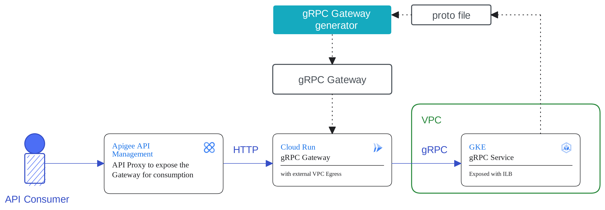

# gRPC to HTTP Gateway Generator

The purpose of this tool is to generate a gRPC to HTTP gateway based on a protocol buffer.
It leverages the [gRPC Gateway](https://github.com/grpc-ecosystem/grpc-gateway) project to generate the gateway code.

The generated gRPC gateway can then be used to create HTTP adapters for gRPC services and use them in a classical HTTP REST-based API management environment.



## Prerequisites

The generator assumed you have the protobuf compiler `protoc` installed.

Note that `protoc` is pre-installed on Cloud Shell.

To install `protoc` with `apt`, run the following command:

```sh
apt install -y protobuf-compiler
```

## Generate the Gateway Code

The gateway is generated based on a protocol buffer file that  you supply with the `--proto-path` flag:

```sh
./generate-gateway.sh --proto-path ./examples/currency.proto
```

Optionally you can also specify the desired output directory with the `--output` flag. If no output directory is specified the output will be generated in the `./generated/gateway` folder.

## Run the Gateway

You can run the gateway locally with the following commands and point to a gRPC server endpoint that runs on localhost port 9090: 

```sh
(cd generated/gateway && go run main.go --grpc-server-endpoint localhost:9090)
```

If you preffer to run the gateway as a container use the following commands to build and run the gateway container:

```sh
(cd generated/gateway && docker build . -t gateway:latest)
docker run -p 8080:8080 -e GRPC_SERVER_ENDPOINT=localhost:9090 gateway:latest
```

## Try it out locally

With the gateway running you can call the automatically generated API endpoints of the gateway to consume your gRPC service.

With the gRPC Gateway pointing to an exposed currency service of the [microservice demo](https://github.com/GoogleCloudPlatform/microservices-demo) the currency conversion request would look like this:

```sh
curl -X POST localhost:8080/hipstershop.CurrencyService/Convert -d '{"from": {"units": 3, "currency_code": "USD", "nanos": 0}, "to_code": "CHF"}'
```

Whist the code to request supported currencies looks like this:

```sh
curl -X POST localhost:8080/hipstershop.CurrencyService/GetSupportedCurrencies
```

Note that the automatically generated API doesn't yet come in a RESTful format. This is one of the aspects that can be changed in an API management layer to improve the overall usability and security of the API.

### Deploy to Cloud Run

Once we've tested the gateway locally we can deploy it to Cloud Run for production use.

```sh
(cd generated/gateway && gcloud run deploy currency-grpc-gw --source . --allow-unauthenticated --region europe-west1 --project $PROJECT_ID)
```

## Expose the Cloud Run Service via Apigee

With the Gateway running in Cloud Run we can now expose it via Apigee.
For detailed instructions on how to expose a cloud run service in Apigee please see [this reference implementation](https://github.com/apigee/devrel/tree/main/references/cloud-run).
