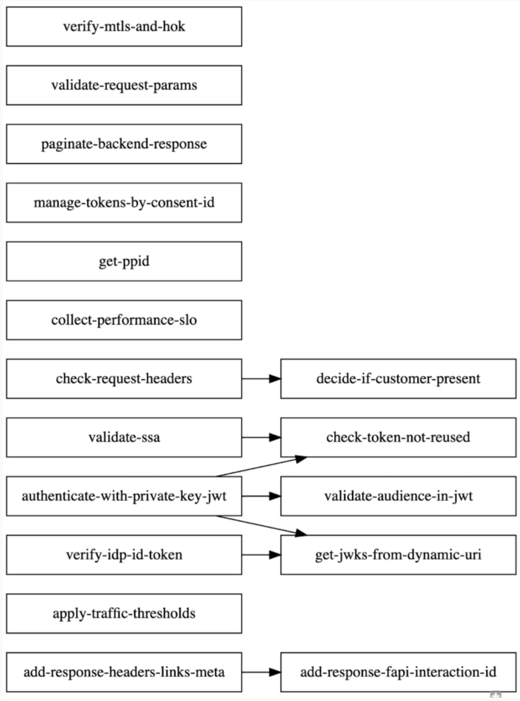

# gensfds Generate Shared Flow Dependencies

A tool which generates the topologically sorted list of Apigee Shared Flows. This is helpful to figure out the correct install sequence for Apigee Shared Flows.

Apigee X/Hybrid causes an error condition if a FlowCallout policy refers to
a Shared Flow that is not deployed yet.

The tool also generates dot file that visualizes the dependencies.

Here is a sample dependencies graph:

<!-- markdownlint-disable-next-line MD013 MD033 -->


## Dependencies

- bash and POSIX Linux

## Prerequisites and Installation

The simplest way is to directly download a script into a directory of your choice
and change its executable permissions.

```bash
curl -LO https://raw.githubusercontent.com/apigee/devrel/main/tools/sf-dependency-list/src/gensfds.sh &&chmod +x gensfds.sh
```

## Usage

```bash
gensfds <directory-with-shared-flows> tsort|dot
```

### Parameters

Two positional parameters:

- directory that contains a collection of shared flows
- type of output: tsort or dot

### Example

```bash
gensfds . dot
```